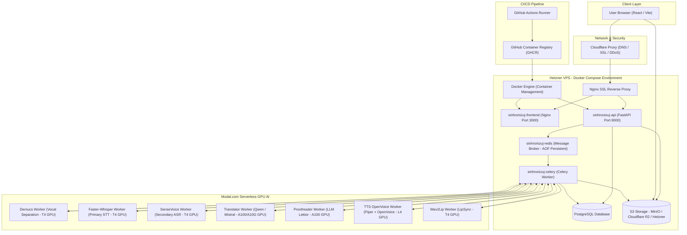

# 🎙️ Sinhronizuj.me

### AI Video Dubbing & Voice Cloning into Serbian — Hybrid Architecture (VPS + Modal.com)

**Sinhronizuj.me** is an advanced end-to-end system for automated video dubbing and voice cloning into the Serbian language. Leveraging a hybrid cloud architecture, the system combines the stability and cost-efficiency of a **Control Plane** on a Hetzner VPS with the on-demand serverless GPU compute power of **Modal.com** to execute compute-heavy AI models.

---

## 🚀 Key Features

*   **Hybrid Cloud Architecture**: Control logic, PostgreSQL database, asynchronous Celery worker, and S3-compatible object storage run on a Hetzner VPS, while intensive AI workloads (vocal separation, STT, translation, proofreading, voice cloning, and Wav2Lip LipSync) run serverless on **Modal.com** (T4, L4, A10G, and A100 GPUs) with scale-to-zero cost efficiency.
*   **Modular Frontend (DAW Studio)**: Fully refactored into modular React components:
    *   `StudioTimeline`: Interactive timeline view featuring the original audio waveform and resizable TTS blocks.
    *   `SegmentEditor`: Translation editor with per-segment voice selection, playback speed, volume, and pitch control.
    *   `AudioMixer`: Real-time volume mixer integrated into the player for original and dubbed audio channels.
    *   `DashboardView`: Instant project overview, real-time progress indicators, and video upload with preview.
    *   `LandingPage`: Modern glassmorphic landing page for unauthenticated visitors.
*   **Undo/Redo History**: Built into `StudioContext.jsx` with a history stack depth of up to 50 steps, allowing users to effortlessly revert/redo edits within the DAW studio.
*   **Mobile Responsiveness**: Responsive layout optimized for mobile viewports by replacing fixed `100vh` heights (via `.studio-mode-active` / `.studio-mode-inactive`), adapting controls into a 2x2 grid, and providing compact status indicators.
*   **One-Click AI Proofreading & Shortening (Magic Shorten)**: A magic wand tool sends requests to the serverless LLM proofreader to intelligently compress and shorten Serbian translations to fit the exact duration of the original audio segment.
*   **Advanced Translation Pipeline**: Robust translation process featuring **Sentence-level Re-segmentation** (merging dependent fragments into complete sentences before translation and redistributing post-translation), **Multi-turn Critique**, and hybrid **LLM-as-a-Judge** quality gating (combining CometKiwi semantic scoring with dedicated LLM evaluations) to guarantee natural phrasing, grammatical correctness, strict Ekavian dialect enforcement, and word-spelled numbers.
*   **Voice Cloning & Audio Enhancement**: **Piper TTS** (Serbian Marko model) generates the base speech, while **OpenVoice v2** transfers the original speaker's vocal timbre (speaker embeddings extracted from clean separated speech). A CFM enhancer (Resemble Enhance) eliminates background artifacts and upsamples audio to 44.1 kHz studio quality.
*   **Dynamic Time Alignment (`merger.py`)**: If the generated Serbian speech exceeds the original segment duration, dynamic time-stretching (`speedup_audio_file` via FFmpeg `atempo`) is automatically applied to prevent collisions with subsequent segments and maintain video synchronization.
*   **Comprehensive Admin Dashboard**: Administrative suite with closed beta waitlist management, user permissions management, aggregated system metrics, and real-time Celery worker log inspection per project.
*   **Security & Quotas**: Rate limiting, SSRF protection, pre-signed S3 URLs, JWT authentication, and per-user limits for maximum file size, daily upload bandwidth, and processing duration.

---

## 🌐 Architecture & Infrastructure

The Mermaid diagram below illustrates the data flow and system topology across the sinhronizuj.me infrastructure:



---

## 🛠️ Technology Stack

| Layer | Technologies & Models |
| :--- | :--- |
| **Frontend** | React (Vite), Vanilla CSS (Premium Glassmorphism), HTML5 Audio API, Lucide Icons |
| **Control Plane (VPS)** | FastAPI (API Gateway), Celery (Async Task Queue), Redis (Message Broker with AOF persistence), PostgreSQL (Database), S3-compatible storage (MinIO, Cloudflare R2, or Hetzner Object Storage) |
| **Compute Plane (Modal)** | **Demucs v4** (Vocal separation), **Faster-Whisper** (Primary STT), **SenseVoice Small** (Secondary ASR), **Mistral Small 24B / Qwen** (Translation & Proofreading), **Piper TTS (Marko) & OpenVoice v2** (Speech synthesis & Timbre cloning), **Wav2Lip** (Visual lip synchronization) |

---

## 📦 Project Structure

```
sinhronizuj.me/
├── .github/workflows/       # CI/CD Workflows (GitHub Actions)
│   ├── backend-ci.yml       # Code linting (Ruff) and security scanning (Bandit SAST)
│   ├── frontend-ci.yml      # Vitest and Playwright test execution
│   └── deploy.yml           # Automated CD to Hetzner VPS (Staging / Production)
├── backend/
│   ├── main.py              # FastAPI server (API gateway orchestrator & lifespan initialization)
│   ├── alembic/             # Alembic database migrations configuration & versions
│   ├── core/
│   │   ├── config.py        # Central configuration (limits, quotas, S3 providers)
│   │   ├── database.py      # SQLAlchemy database engine and session
│   │   ├── auth.py          # JWT authentication and blocklist validation
│   │   ├── limiter.py       # SlowAPI rate limiter
│   │   └── models.py        # SQLAlchemy models (User, Project, Segment, Glossary, Waitlist, Job)
│   ├── routes/              # Modular FastAPI APIRouters
│   │   ├── auth.py          # Authentication routes (register, login, me, logout)
│   │   ├── projects.py      # Project lifecycle, upload presigned URLs, and analysis triggers
│   │   ├── segments.py      # Segment editing, live preview, shortening, and TTS rendering
│   │   ├── admin.py         # Administration stats, waitlist review, and user management
│   │   ├── websocket.py     # Real-time WebSocket updates for project processing
│   │   └── system.py        # Hardware monitoring, worker warmup, and job status
│   ├── services/            # Auxiliary services
│   │   ├── redis.py         # Redis client wrapper
│   │   └── s3.py            # S3-compatible storage helper methods
│   └── worker/
│       ├── tasks.py         # Celery tasks (isolated workspaces, caching, analysis, and rendering)
│       ├── downloader.py    # S3 and YouTube video downloader with SSRF protection
│       ├── numbers_to_words.py # Number, date, and percentage expansion into Serbian words
│       ├── translation/     # English-to-Serbian translation & proofreading pipeline
│       │   ├── masking.py   # Technical entity masking (Wi-Fi, GPS, URLs, etc.)
│       │   ├── transliter.py # Transliteration and dictionary replacement
│       │   ├── dialect.py   # Ekavian normalization and morphological cleanup
│       │   ├── glossary.py  # User glossary integration and topic extraction
│       │   ├── qe.py        # CometKiwi QE evaluation and LLM judge gating
│       │   └── translate.py # Core translation, self-critique, and proofreading loop
│       ├── translator.py    # Facade for translation and proofreading services
│       ├── tts_engine.py    # Reference audio extraction, Piper synthesis, and OpenVoice cloning
│       └── merger.py        # FFmpeg/pydub audio mixing, sidechain ducking, and dynamic speedup
├── frontend/
│   ├── src/
│   │   ├── App.jsx          # React router and DAW layout orchestration
│   │   ├── components/      # Modular components (Dashboard, Studio, Admin, Auth, Common, Landing)
│   │   │   ├── Studio/      # StudioTimeline, SegmentEditor, AudioMixer
│   │   │   ├── Dashboard/   # DashboardView, ProjectList
│   │   │   ├── Admin/       # AdminPanel
│   │   │   ├── Landing/     # LandingPage.jsx
│   │   │   └── Common/      # Header, HardwareMonitor, Knob
│   │   ├── context/         # StudioContext.jsx (global application state and undo/redo stack)
│   │   ├── services/        # api.js (client-side API service methods)
│   │   └── index.css        # Global stylesheet (Glassmorphism, custom scrollbars, responsiveness)
│   └── package.json         # Frontend configuration and dependencies
├── modal_workers/           # Serverless AI workers on Modal.com
│   ├── demucs_worker.py     # Demucs vocal and background audio separation (T4 GPU)
│   ├── sensevoice_worker.py # SenseVoice STT transcription (T4 GPU)
│   ├── tts_openvoice.py     # OpenVoice v2 + Piper voice synthesis and cloning (L4 GPU)
│   ├── lektor_worker.py     # Mistral/Qwen LLM translation and proofreading (A100 GPU)
│   └── wav2lip_worker.py    # Wav2Lip visual lip synchronization (T4 GPU)
├── docker-compose.yml       # Docker Compose setup for local development (Postgres, Redis, API)
└── Dockerfile               # Production multi-stage Docker image for API and Celery workers
```

---

## 🖥️ Local Setup & Development

### 1. Start Infrastructure (Docker)
In the project root, start PostgreSQL and Redis services:
```bash
docker compose up -d
```

### 2. Backend Setup & Migrations
Activate your virtual environment, run database migrations with Alembic, and launch the FastAPI server:
```bash
# Activate virtual environment
source venv/bin/activate

# Apply the latest migrations to PostgreSQL
cd backend
alembic upgrade head
cd ..

# Start the FastAPI API Gateway
uvicorn backend.main:app --host 0.0.0.0 --port 8000 --reload
```

### 3. Start Celery Worker
Run the Celery worker process listening to the Redis task queue:
```bash
celery -A backend.worker.celery_app worker --loglevel=info --concurrency=1
```

### 4. Start Frontend
Navigate to the frontend directory, install dependencies, and start the Vite dev server:
```bash
cd frontend
npm install
npm run dev
```

### 5. Running Tests
Run test suites locally to ensure code correctness:
*   **Backend Tests & Linting**:
    ```bash
    pytest
    ruff check .
    bandit -r backend/
    ```
*   **Frontend Tests** (Vitest unit tests & Playwright E2E):
    ```bash
    cd frontend
    npm run test:run     # Run Vitest component unit tests
    npx playwright test  # Run Playwright E2E tests
    ```

---

## ⚙️ Configuration (.env)

Create a `.env` file in the root directory with the following variables:

```env
# Database Configuration (Docker / PostgreSQL)
POSTGRES_USER=postgres
POSTGRES_PASSWORD=your_db_password
POSTGRES_DB=sinhronizuj_db
DATABASE_URL=postgresql://postgres:your_db_password@db:5432/sinhronizuj_db

# JWT Parameters
JWT_SECRET=your_jwt_secret_key
JWT_ALGORITHM=HS256
ACCESS_TOKEN_EXPIRE_MINUTES=60

# Modal Serverless Endpoints
MODAL_STT_URL=https://your-username--sm-stt-only-sttworker-task.modal.run
MODAL_SENSEVOICE_URL=https://your-username--sm-sensevoice-stt-sensevoice-task.modal.run
MODAL_TRANSLATOR_URL=https://your-username--sm-translator-serve.modal.run
MODAL_LEKTOR_URL=https://your-username--sinhronizuj-lektor-serve.modal.run
MODAL_TTS_URL=https://your-username--sm-tts-v110-workerv110-task.modal.run
MODAL_WAV2LIP_URL=https://your-username--wav2lip-worker-render-task.modal.run

# Audio Quality Switches
DISABLE_OPENVOICE=False
DISABLE_ENHANCE=False

# Redis & Network Parameters
REDIS_URL=redis://redis:6379/0
REDIS_PASSWORD=your_redis_password

# S3 Storage Configuration (supports: minio, hetzner, r2, s3)
STORAGE_PROVIDER=minio
MINIO_ENDPOINT=localhost:9000
MINIO_ACCESS_KEY=minioadmin
MINIO_SECRET_KEY=minioadmin
MINIO_BUCKET=uploads
MINIO_PUBLIC_ENDPOINT=http://localhost:9000
MINIO_SECURE=False

# External S3 Parameters (used when STORAGE_PROVIDER=hetzner, r2, or s3)
S3_ENDPOINT=https://your-s3-endpoint
S3_ACCESS_KEY=your-s3-access-key
S3_SECRET_KEY=your-s3-secret-key
S3_BUCKET=your-s3-bucket
S3_PUBLIC_ENDPOINT=https://your-public-s3-endpoint
S3_SECURE=True
S3_REGION=us-east-1

# User Limits & Quotas
MAX_SINGLE_FILE_SIZE_MB=250
MAX_DAILY_UPLOAD_MB=1000
MAX_DAILY_DURATION_SEC=3600
```

```

---

## 🗺️ Roadmap & Future Enhancements

1.  **Automated Diarization (Multi-Voice Cloning)**: Integrating `PyAnnote.audio` on Modal to distinguish distinct speakers (interviews, podcasts) and synthesize each segment with the corresponding cloned voice profile.
2.  **HD Face Restoration for LipSync**: Passing Wav2Lip output frames through face restoration networks (such as CodeFormer or GFPGAN) to eliminate blur around the mouth region and output crisp HD video.
3.  **Interactive Waveform Time-Stretching**: Enhanced `StudioTimeline` component enabling direct visual drag-and-drop time-stretching and audio compression on the waveform canvas.

---

**Sinhronizuj.me** — *Because technology should speak your language.* 🎙️🇷🇸
