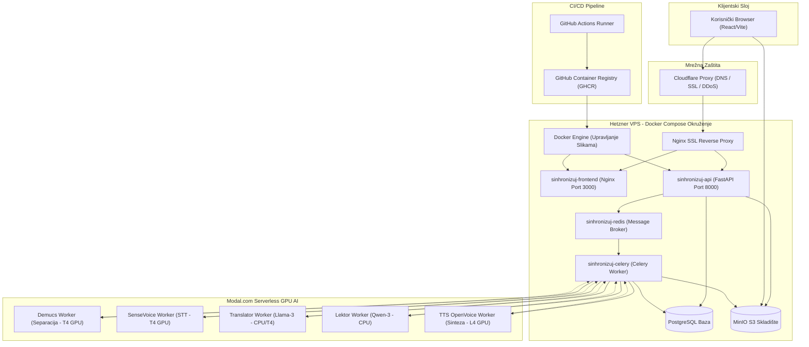

# 🎙️ Sinhronizuj.me

### AI Video Sinhronizacija na Srpski Jezik — Hibridna Arhitektura (VPS + Modal.com)

**Sinhronizuj.me** je napredni "end-to-end" sistem za automatsku video sinhronizaciju (dubbing) na srpski jezik sa kloniranjem originalnog glasa. Koristeći hibridnu cloud arhitekturu, sistem kombinuje stabilnost i pristupačnost **Control Plane-a** na Hetzner VPS-u sa serverless GPU snagom na **Modal.com** platformi za izvršavanje zahtevnih AI modela na zahtev.

---

## 🚀 Ključne Karakteristike

*   **Hibridna Cloud Arhitektura**: Kontrolna logika, baza podataka, asinhroni Celery radnik i S3 skladište nalaze se na Hetzner VPS-u, dok se teške AI operacije (separacija zvuka, STT, prevod, lektura i kloniranje glasa) izvršavaju serverless na **Modal.com** (T4, L4 i A10G GPU-ovi) uz model plaćanja po utrošku (scale-to-zero).
*   **Modularni Frontend (DAW Studio)**: Korisnički interfejs je kompletno refaktorisan u modularne komponente. Sadrži:
    *   `StudioTimeline`: Interaktivni prikaz vremenske linije sa waveform-om originalnog zvuka.
    *   `SegmentEditor`: Uređivanje prevoda, izbor glasa i kontrola brzine, jačine i visine tona po segmentu.
    *   `AudioMixer`: Slajderi integrisani u plejer za kontrolu nivoa jačine originala i sinhronizovanog glasa u realnom vremenu.
    *   `DashboardView`: Brz pregled projekata i upload videa sa pre-vizuelizacijom.
*   **Undo/Redo Mehanizam**: Ugrađen u `StudioContext.jsx` sa istorijskim stekom dubine do 50 koraka, omogućavajući klijentu lako poništavanje grešaka tokom editovanja u DAW-u.
*   **Mobilna Responzivnost**: Aplikacija je optimizovana za mobilne uređaje uklanjanjem fiksne `100vh` visine (kroz klase `.studio-mode-active` i `.studio-mode-inactive`), preslaganjem kontrola u 2x2 mrežu i kompaktnim statusnim ikonama.
*   **AI Lektor na klik (Magic Shorten)**: Integrisana opcija čarobnog štapića šalje zahtev Modal Qwen Lektoru da inteligentno skrati srpski prevod na optimalnu dužinu kako bi se uklopio u originalno trajanje videa.
*   **Kloniranje Glasa i Audio Poboljšanje**: MeloTTS generiše bazni srpski govor, a **OpenVoice v2** vrši prenos boje glasa iz originalnog audio snimka (Speaker Embedding izvučen iz čistog originalnog audia). CFM model (Resemble Enhance) dodatno otklanja šum i podiže frekvenciju na 44.1kHz.
*   **Dinamičko Uklapanje vremena (`merger.py`)**: Ukoliko je izgenerisani srpski govor duži od originalnog segmenta, sistem automatski primenjuje ubrzavanje (`speedup_audio_file` preko FFmpeg-a) kako bi sprečio kolizije sa sledećim segmentima i desinhronizaciju videa.
*   **Kompletan Admin Panel**: Administratorski interfejs sa praćenjem waitlist-a (zatvorene bete), upravljanjem korisnicima (dodeljivanje admin privilegija), zbirnom statistikom i live pretragom logova Celery radnika za svaki pojedinačni projekat.

---

## 🌐 Arhitektura i Infrastruktura

Mermaid dijagram ispod prikazuje protok podataka i povezanost komponenti unutar sinhronizuj.me sistema:



---

## 🛠️ Tehnološki Stack

| Sloj | Tehnologije i Modeli |
| :--- | :--- |
| **Frontend** | React (Vite), Vanilla CSS (Premium Glassmorphism), HTML5 Audio API |
| **Control Plane (VPS)** | FastAPI (API server), Celery (Asinhroni radnik), Redis (Message Broker), PostgreSQL (Baza), MinIO S3 (Skladište) |
| **Compute Plane (Modal)** | **Demucs v4** (Separacija vokala), **SenseVoice Large** (ASR/STT), **Llama-3-8B** (Prevod), **Qwen-3** (Lektor), **OpenVoice v2 & MeloTTS** (Sinteza/Kloniranje) |

---

## 📦 Struktura Projekta

```
sinhronizuj.me/
├── .github/workflows/       # CI/CD Workflows (GitHub Actions)
│   ├── backend-ci.yml       # Pokretanje pytest-a pri push-u
│   ├── frontend-ci.yml      # Pokretanje vitest-a pri push-u
│   └── deploy.yml           # CD na Hetzner VPS (Development / Production)
├── backend/
│   ├── main.py              # FastAPI server (API endpointovi i startup logika lifespan-a)
│   ├── alembic/             # Alembic konfiguracija i migracione skripte
│   ├── core/
│   │   ├── config.py        # Centralna konfiguracija (očišćena od legacy RunPod ključeva)
│   │   ├── database.py      # SQLAlchemy povezivanje baze
│   │   └── models.py        # SQLAlchemy modeli (User, Project, Segment, Glossary, Waitlist)
│   └── worker/
│       ├── tasks.py         # Celery taskovi (workspace izolacija, analyze i render zadaci)
│       ├── downloader.py    # Preuzimanje videa sa S3
│       ├── translator.py    # Pozivanje Modal Translator i Lektor API-ja sa glosarima
│       ├── tts_engine.py    # Priprema referentnog audia
│       └── merger.py        # FFmpeg/pydub audio miksovanje i dinamički speedup
├── frontend/
│   ├── src/
│   │   ├── App.jsx          # React ruter i globalni raspored
│   │   ├── components/      # Modularne komponente (Dashboard, Studio, Admin, Auth, Common)
│   │   │   ├── Studio/      # StudioTimeline, SegmentEditor, AudioMixer, MixerPanel
│   │   │   ├── Dashboard/   # DashboardView, ProjectList
│   │   │   ├── Admin/       # AdminPanel
│   │   │   └── Common/      # Header, HardwareMonitor, Knob
│   │   ├── context/         # StudioContext.jsx (globalno stanje i undo/redo stek)
│   │   ├── services/        # api.js (integrisane klijentske API funkcije)
│   │   └── index.css        # Globalni CSS (Glassmorphism, custom scroll, responzivnost)
│   └── package.json         # Konfiguracija i skripta "test:run": "vitest run"
├── modal_workers/           # Serverless radnici na Modal.com
│   ├── demucs_worker.py     # Demucs separacija vokala (T4 GPU)
│   ├── sensevoice_worker.py # SenseVoice STT transkripcija (T4 GPU)
│   ├── translator_worker.py # Llama prevodilac (CPU/T4)
│   ├── tts_openvoice.py     # OpenVoice + MeloTTS kloniranje (L4 GPU)
│   └── lektor_worker.py     # Lektorisanje i skraćivanje teksta
├── sicret doc/              # [IGNORISANO] Tajna, detaljna tehnička dokumentacija
├── docker-compose.yml       # Docker compose za lokalne servise (Postgres, Redis, API)
└── Dockerfile               # API/Worker Docker slika za server
```

---

## 🖥️ Pokretanje i Testiranje (Lokalno)

### 1. Podizanje Infrastrukture (Docker)
U korenskom direktorijumu pokrenite Postgres i Redis servise:
```bash
docker compose up -d
```

### 2. Pokretanje i Migracija Bekenda
Aktivirajte virtuelno okruženje, primenite Alembic migracije i pokrenite FastAPI server:
```bash
# Aktiviranje venv-a
source venv/bin/activate

# Primena najnovije migracije na Postgres
cd backend
alembic upgrade head
cd ..

# Pokretanje FastAPI API Gateway-a
uvicorn backend.main:app --host 0.0.0.0 --port 8000 --reload
```

### 3. Pokretanje Celery Radnika
Pokrenite Celery proces koji osluškuje Redis red poslova:
```bash
celery -A backend.worker.celery_app worker --loglevel=info --concurrency=1
```

### 4. Pokretanje Frontenda
Uđite u frontend folder, instalirajte pakete i pokrenite Vite server:
```bash
cd frontend
npm install
npm run dev
```

### 5. Pokretanje Testova
Sistem poseduje automatizovane testove i na backendu i na frontendu:
*   **Backend testovi** (pytest sa SQLite in-memory bazom):
    ```bash
    pytest
    ```
*   **Frontend testovi** (Vitest):
    ```bash
    cd frontend
    npm run test:run
    ```

---

## ⚙️ Konfiguracija (.env)

Kreirajte `.env` datoteku u korenu projekta sa sledećim varijablama:

```env
# Konfiguracija baze podataka (Docker)
POSTGRES_USER=postgres
POSTGRES_PASSWORD=tvoja_db_lozinka
POSTGRES_DB=sinhronizuj_db

# JWT i Admin parametri na startup-u
SECRET_KEY=tvoj_jwt_secret_key
ADMIN_EMAIL=admin@sinhronizuj.me
ADMIN_PASSWORD=tvoja_admin_lozinka_na_startu

# Modal Serverless Endpoints
MODAL_STT_URL=https://tvoj-username--sm-stt-only-sttworker-task.modal.run
MODAL_TRANSLATOR_URL=https://tvoj-username--sm-translator-serve.modal.run
MODAL_LEKTOR_URL=https://tvoj-username--sinhronizuj-lektor-serve.modal.run
MODAL_TTS_URL=https://tvoj-username--sm-tts-v110-workerv110-task.modal.run

# Prekidači za audio kvalitet
DISABLE_OPENVOICE=False
DISABLE_ENHANCE=False

# Mrežni parametri
REDIS_URL=redis://redis:6379/0
MINIO_ENDPOINT=tvoja-vps-ip:9000
MINIO_ACCESS_KEY=sinhronizuj_storage
MINIO_SECRET_KEY=tvoja_s3_lozinka
MINIO_BUCKET=uploads
```

---

## 🗺️ Plan Daljeg Razvoja

1.  **Automatska Diarizacija (Multi-Voice Cloning)**: Integracija `PyAnnote.audio` modela na Modalu kako bi se u pozadini prepoznali pojedinačni govornici (intervjui/podkasti) i svaki segment se sintetizovao glasom koji odgovara tom govorniku.
2.  **HD Face Restoration za LipSync**: Propuštanje Wav2Lip izlaza kroz modele poput GFPGAN ili CodeFormer kako bi se eliminisala zamućenost lica oko predela usana i postigla HD rezolucija.
3.  **Drag-and-Drop Vremensko Rastezanje**: Unapređenje `StudioTimeline` komponente koja bi preko wavesurfer.js-a omogućila vizuelno povlačenje i rastezanje/skraćivanje blokova zvuka direktno na talasu.

---

**Sinhronizuj.me** — *Jer tehnologija treba da priča tvojim jezikom.* 🇷🇸
