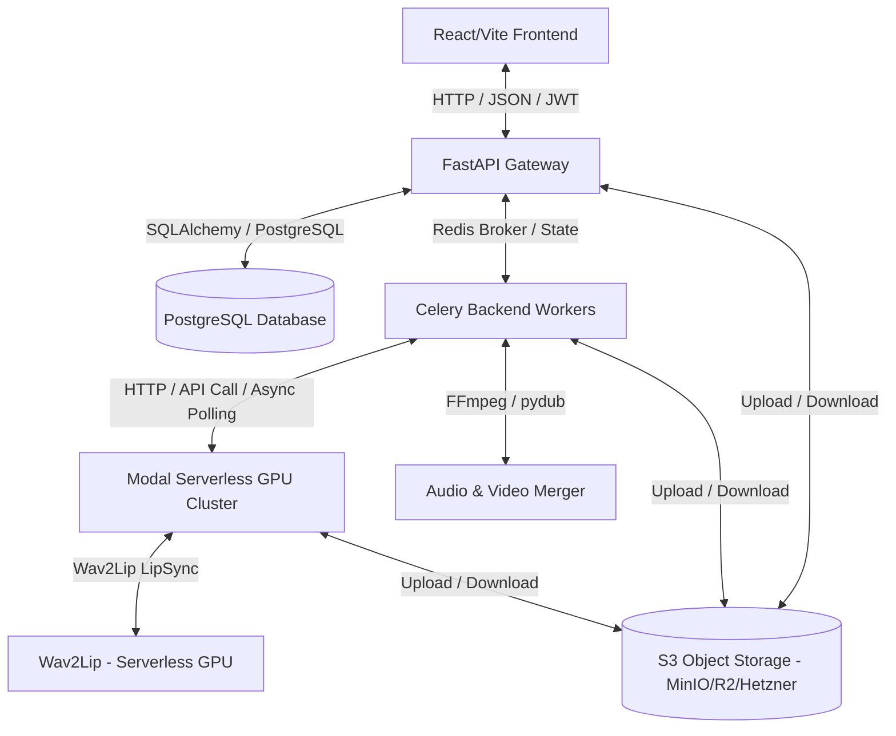

# Arhitektura Sistema i Baza Podataka (sinhronizuj.me)

Ovaj dokument pruža detaljan tehnički pregled arhitekture sistema platforme **sinhronizuj.me** i njene baze podataka. Dokument je namenjen inženjerima i sistemskim arhitektama za razumevanje toka podataka, modela i upravljanja stanjem baze.

---

## 1. Troslojna Arhitektura Sistema

Platforma se zasniva na troslojnoj (3-tier) distribuiranoj arhitekturi, optimizovanoj za rukovanje teškim audio/video procesiranjem i serverless AI operacijama:



### Slojevi sistema:
1.  **Klijentski sloj (Frontend)**: React.js aplikacija izgrađena pomoću Vite-a. Komunicira sa FastAPI backendom preko REST API-ja. Koristi JWT autentifikaciju za bezbedan pristup resursima.
2.  **Aplikacioni / Orkestracioni sloj (Backend & Celery)**:
    *   **FastAPI API Gateway**: Modularni ruter koji prihvata zahteve klijenata, upravlja sesijama, validira podatke preko Pydantic šema, generiše S3 upload URL-ove, primenjuje kvote i limite i šalje dugotrajne poslove (analiza, renderovanje) u asinhroni red.
    *   **Celery Workers (Host mašina)**: Pokreću se na CPU resursima host servera. Koriste Redis kao broker sa AOF perzistencijom. Zaduženi su za orkestraciju poslova obrade videa, preuzimanje fajlova, lokalno procesiranje i spajanje audia/videa pomoću FFmpeg/pydub biblioteka.
3.  **AI Računarski sloj (Modal Serverless GPU)**:
    *   Modal serverless klaster koji se dinamički skalira (scale-to-zero) i koristi GPU instance po potrebi (T4, A10G, L4 ili A100).
    *   Izvršava modele za prepoznavanje govora (SenseVoice / Faster-Whisper), razdvajanje audio izvora (Demucs), mašinsko prevođenje (Qwen2-VL), lekturu (Qwen3), glasovnu sintezu sa kloniranjem (Piper + OpenVoice v2) i vizuelni lipsync (Wav2Lip).

---

## 2. Tok Podataka i Komunikacija

Tokom procesa sinhronizacije videa, podaci prolaze kroz sledeće faze:

1.  **Faza Inicijalizacije i Upload-a**:
    *   Korisnik na frontendu bira video fajl.
    *   Frontend traži potpisan URL za direktan upload na S3 skladište od FastAPI-ja (`GET /api/v1/storage/upload_url`).
    *   Video se bezbedno šalje direktno na S3 iz klijenta radi izbegavanja opterećenja API gateway-a.
2.  **Faza Analize Videa**:
    *   Nakon upload-a, klijent poziva `POST /api/v1/process-video` inicirajući Celery zadatak `analyze_video_task`.
    *   Celery radnik preuzima video sa S3, poziva **Modal Demucs** worker za izolaciju vokala od pozadinske buke.
    *   Nakon toga, izolovani vokali se šalju na **Modal SenseVoice STT** za transkripciju sa vremenskim kodovima.
    *   Tekst se prevodi na srpski pomoću **Modal Translator**-a (koji primenjuje korisnički definisane glosare za konzistentnost).
    *   Rezultujući segmenti se upisuju u PostgreSQL bazu, a status projekta prelazi u `ready`.
3.  **Faza Uređivanja (Studio DAW)**:
    *   Korisnik u realnom vremenu modifikuje prevod, podešava jačinu originalnog glasa, pozadinske muzike i sintetizovanog govora, menja brzinu reprodukcije i vrstu glasa (npr. klonirani ili generički muški).
    *   Svaka izmena se skladišti u PostgreSQL-u i lokalnom undo/redo steku klijenta.
4.  **Faza Sinteze i Renderovanja**:
    *   Kada klijent zatraži pregled segmenta ili finalni render, backend poziva **Modal OpenVoice/TTS** koji generiše srpski audio fajl na osnovu prenesenog teksta, brzine i glasa izdvojenog iz originalnih vokala (kloniranje).
    *   Za finalni render (`render_video_task`), Celery radnik kombinuje sve sintetizovane audio segmente, vrši njihovo vremensko uklapanje i miksovanje sa pozadinskim zvukom (no-vocals audio) u optimalnom omjeru jačine, a zatim spaja dobijeni audio sa video trakom pomoću FFmpeg-a. Finalni fajl se otprema na S3.

---

## 3. Specifikacija Baze Podataka (SQLAlchemy Modeli)

Baza podataka koristi PostgreSQL. U nastavku je detaljna definicija tabela mapiranih kroz SQLAlchemy modele u [backend/core/models.py](file:///home/gruya/Projektri/sinhronizuj.me/backend/core/models.py).

### Specijalni tip: GUID
Zbog korišćenja UUID ključeva umesto auto-inkrementalnih integera (radi veće bezbednosti i nemogućnosti predviđanja ID-eva), implementiran je `GUID` tip dekorator koji na PostgreSQL nivou koristi nativni `UUID` tip, dok se na lokalnim SQLite okruženjima za testiranje mapira na `CHAR(32)`:

```python
class GUID(TypeDecorator):
    impl = CHAR
    cache_ok = True
    # ... rukovanje bind parametrima i rezultatima u zavisnosti od dijalekta baze
```

### 3.1. Tabela Korisnika (`users`)
Služi za registraciju korisnika, verifikaciju lozinke i definisanje privilegija.

| Kolona | Tip Podataka | Ograničenja | Opis |
| :--- | :--- | :--- | :--- |
| `id` | `GUID` | Primary Key, Default UUID | Jedinstveni identifikator korisnika |
| `email` | `String` | Unique, Index, Nullable=False | Email adresa korisnika |
| `password_hash` | `String` | Nullable=False | Hešovana lozinka (koristi passlib/bcrypt) |
| `is_admin` | `Boolean` | Default=False, Server Default=false | Indikator administratorskih privilegija |
| `created_at` | `DateTime` | Default=UTC.now | Datum i vreme registracije naloza |

**Relacije:**
*   `projects`: Jedan korisnik može imati više projekata (`one-to-many` prema tabeli `projects`, kaskadno brisanje).
*   `glossaries`: Jedan korisnik može definisati više glosarskih parova (`one-to-many` prema tabeli `glossaries`, kaskadno brisanje).

### 3.2. Tabela Projekata (`projects`)
Sadrži meta-podatke o video fajlovima i putanjama na S3 skladištu.

| Kolona | Tip Podataka | Ograničenja | Opis |
| :--- | :--- | :--- | :--- |
| `id` | `GUID` | Primary Key, Default UUID | Jedinstveni identifikator projekta |
| `name` | `String` | Nullable=False | Korisnički definisan naziv projekta |
| `user_id` | `GUID` | ForeignKey(users.id, CASCADE), Nullable=False | Vlasnik projekta |
| `status` | `String` | Default="empty" | Status projekta (`empty`, `analyzing`, `ready`, `completed`) |
| `video_title` | `String` | Default="" | Naslov video fajla (npr. naziv učitanog fajla) |
| `video_s3_key` | `String` | Nullable=True | Putanja do originalnog videa na S3 |
| `vocals_s3_key` | `String` | Nullable=True | Putanja do izdvojenog vokala na S3 |
| `no_vocals_s3_key` | `String` | Nullable=True | Putanja do videa/audia bez vokala na S3 |
| `visual_context_s3_key` | `String` | Nullable=True | Putanja do metapodataka o vizuelnom kontekstu |
| `dubbed_audio_s3_key` | `String` | Nullable=True | Putanja do izgenerisanog srpskog audio miksa |
| `final_video_s3_key` | `String` | Nullable=True | Putanja do finalnog sinhronizovanog videa |
| `costs` | `JSON` | Nullable=True | Detaljna struktura troškova obrade na Modalu |
| `created_at` | `DateTime` | Default=UTC.now | Vreme kreiranja projekta |

**Relacije:**
*   `user`: Povezuje projekat sa roditeljskim korisnikom (`many-to-one`).
*   `segments`: Povezuje sa svim segmentima prevoda (`one-to-many` prema tabeli `segments`, kaskadno brisanje).

### 3.3. Tabela Segmenata (`segments`)
Sadrži vremenske isečke, tekstualni prevod i parametre audio sinteze za svaki segment videa.

| Kolona | Tip Podataka | Ograničenja | Opis |
| :--- | :--- | :--- | :--- |
| `project_id` | `GUID` | ForeignKey(projects.id, CASCADE), Primary Key | Projekat kojem segment pripada |
| `segment_id` | `Integer` | Primary Key | Hronološki indeks segmenta (0, 1, 2...) |
| `start` | `Float` | Nullable=False | Početno vreme segmenta u sekundama |
| `end` | `Float` | Nullable=False | Krajnje vreme segmenta u sekundama |
| `original` | `String` | Default="" | Originalni transkript govora na izvornom jeziku |
| `translated` | `String` | Default="" | Prevedeni srpski tekst |
| `voice_type` | `String` | Default="clone" | Izbor glasa (`clone` za kloniranje, `male` za generički) |
| `volume` | `Float` | Default=0.0 | Jačina glasa u decibelima (relativno od originala) |
| `speed` | `Float` | Default=1.0 | Faktor brzine reprodukcije (npr. 1.0 = normalno) |
| `pitch` | `Float` | Default=0.0 | Modifikacija visine glasa |
| `bg_volume` | `Float` | Default=0.0 | Jačina pozadinskog zvuka tokom ovog segmenta |
| `tts_s3_key` | `String` | Nullable=True | Putanja do generisanog srpskog govora za ovaj segment |
| `tts_duration` | `Float` | Nullable=True | Realno trajanje izgenerisanog audio zapisa |
| `status` | `String` | Default="edited" | Status segmenta (`edited`, `previewed`) |

**Relacije:**
*   `project`: Povezuje segment sa roditeljskim projektom (`many-to-one`).

### 3.4. Tabela Glosara (`glossaries`)
Služi za definisanje pravila prevođenja specifičnih reči (rečnik).

| Kolona | Tip Podataka | Ograničenja | Opis |
| :--- | :--- | :--- | :--- |
| `id` | `GUID` | Primary Key, Default UUID | Identifikator glosarskog para |
| `user_id` | `GUID` | ForeignKey(users.id, CASCADE), Nullable=False | Vlasnik glosara |
| `source_word` | `String` | Nullable=False | Izvorna reč (npr. na engleskom) |
| `target_word` | `String` | Nullable=False | Željeni prevod (na srpskom) |
| `created_at` | `DateTime` | Default=UTC.now | Vreme dodavanja u rečnik |

### 3.5. Tabela Liste Čekanja (`waitlist`)
Evidentira korisnike koji su se prijavili za zatvorenu beta fazu projekta.

| Kolona | Tip Podataka | Ograničenja | Opis |
| :--- | :--- | :--- | :--- |
| `id` | `GUID` | Primary Key, Default UUID | Identifikator prijave |
| `email` | `String` | Unique, Index, Nullable=False | Prijavljeni email |
| `created_at` | `DateTime` | Default=UTC.now | Vreme podnošenja prijave |
| `status` | `String` | Default="pending" | Status prijave (`pending`, `approved`, `rejected`) |

### 3.6. Tabela Poslova (`jobs`)
Prati stanje izvršavanja asinhronih zadataka u realnom vremenu (State Machine).

| Kolona | Tip Podataka | Ograničenja | Opis |
| :--- | :--- | :--- | :--- |
| `id` | `GUID` | Primary Key, Default UUID | Jedinstveni identifikator posla |
| `project_id` | `GUID` | ForeignKey(projects.id, CASCADE), Nullable=True | Projekat povezan sa poslom |
| `status` | `String` | Default="pending" | Status posla (`pending`, `running`, `completed`, `failed`) |
| `phase` | `String` | Default="pending" | Aktivna faza (`downloading`, `separating`, `transcribing`, `translating`, `diarizing`, `mixing`, `lipsyncing`) |
| `attempt` | `Integer` | Default=1 | Trenutni pokušaj izvršavanja |
| `max_attempts` | `Integer` | Default=3 | Maksimalni dozvoljeni broj pokušaja |
| `error_message` | `String` | Nullable=True | Poruka o grešci u slučaju neuspeha |
| `created_at` | `DateTime` | Default=UTC.now | Vreme kreiranja posla |
| `updated_at` | `DateTime` | Default=UTC.now, onupdate | Vreme poslednjeg ažuriranja |

---

## 4. Inicijalizacija i Upravljanje Bazom Podataka

U sklopu bezbednosnog i arhitekturnog ojačavanja (Hardening):
1. **Bezbedan start aplikacije**: Iz [backend/main.py](file:///home/gruya/Projektri/sinhronizuj.me/backend/main.py) su uklonjeni svi startup DDL iskazi poput `Base.metadata.create_all()` i direktne `ALTER TABLE` komande.
2. **Autoritet šeme**: Sve tabele i izmene na šemi se primenjuju isključivo preko Alembic migracionog alata.
3. **Offline Kreiranje Administratora**: Uklonjen je javni API endpoint `/api/v1/admin/create-first-admin` iz bezbednosnih razloga. Novi administratori se kreiraju i promovišu isključivo offline preko CLI komande na host VPS-u:
   ```bash
   python -m backend.cli create_admin --email [EMAIL] --password [PASSWORD]
   ```

---

## 5. Alembic Konfiguracija i Migracioni Tok

U cilju bezbedne nadogradnje šeme baze podataka bez gubitka podataka u produkciji, implementiran je **Alembic** migracioni alat unutar direktorijuma `backend/alembic`.

### Konfiguracione datoteke:
*   [backend/alembic.ini](file:///home/gruya/Projektri/sinhronizuj.me/backend/alembic.ini): Definiše putanje do migracionih skripti i osnovna podešavanja.
*   [backend/alembic/env.py](file:///home/gruya/Projektri/sinhronizuj.me/backend/alembic/env.py): Konfigurisan je da dinamički čita `DATABASE_URL` iz FastAPI podešavanja (`backend.core.config.settings.DATABASE_URL`), što eliminiše potrebu za dupliranjem osetljivih lozinki. Takođe, importuje `Base.metadata` iz `backend.core.models` kako bi omogućio automatsku detekciju promena u šemi (`autogenerate` režim).

### Standardni workflow za migracije:
1.  **Izmena modela**: Nakon izmene u `backend/core/models.py`, programer sa host mašine generiše novu migraciju:
    ```bash
    cd backend
    alembic revision --autogenerate -m "opis_promene"
    ```
2.  **Pregled migracije**: Skripta se generiše u `backend/alembic/versions/`. Zbog korišćenja custom `GUID` tipa, na vrh generisane skripte potrebno je dodati `import backend` kako bi Alembic prepoznao tip `backend.core.models.GUID()`.
3.  **Primena migracije**: U produkcijskom okruženju, prilikom pokretanja novog izdanja, migracija se primenjuje na bazu komandom:
    ```bash
    alembic upgrade head
    ```

