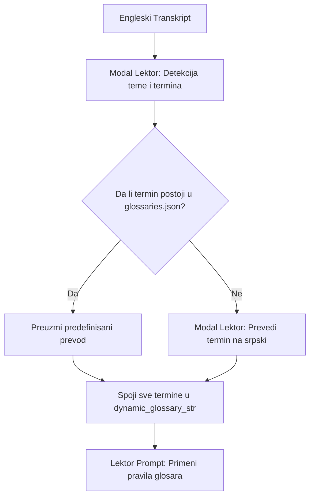

# 📖 Kako funkcioniše Glosar i Regex Post-processor?

Glosar (engl. *Glossary*) je specijalizovani modul unutar platforme **Sinhronizuj.me** koji obezbeđuje tačan, dosledan i prirodan prevod stručnih, tehničkih i žargonskih izraza sa engleskog na srpski jezik (ekavica, latinica). Njegova primarna svrha je da spreči LLM modele da doslovno (bukvalno) prevode specifičnu terminologiju.

Pored glosara, ugrađen je i **Python Regex post-processor** koji programski čisti tekst od LLM anomalija pre slanja na sintezu.

---

## 📍 1. Integracija u Pipeline

Glosar i post-processor su integrisani u **Fazu 1 (Asinhrona analiza videa)** i izvršavaju se u modulu za prevođenje i lekturu:
*   [backend/worker/translator.py](file:///home/gruya/Projektri/sinhronizuj.me/backend/worker/translator.py)

Pozivaju se neposredno pre i nakon pokretanja lekture teksta od strane Lektor modela (`qwen-lektor` na Modal serverless platformi).

---

## ⚙️ 2. Kako funkcioniše Glosar?

Sistem primenjuje **hibridni pristup** koji kombinuje preddefinisane (statičke) rečnike i dinamičko prepoznavanje tema i termina pomoću LLM-a.



### Detaljan opis koraka:

#### Korak 2.1: Preddefinisani Rečnik (`glossaries.json`)
Sistem učitava rečnike iz datoteke [backend/worker/glossaries.json](file:///home/gruya/Projektri/sinhronizuj.me/backend/worker/glossaries.json). Ovi rečnici su ručno mapirani i podeljeni po tematskim kategorijama:
*   **Zanati i Zavarivanje (`welding_and_crafts`)**:
    *   `threaded rod` -> `navojna šipka`
    *   `angle grinder` -> `ugaona brusilica`
    *   `tack weld` -> `heftanje`
*   **Biologija i Priroda (`biology_and_nature`)**:
    *   `yellow fever` -> `žuta groznica`
    *   `breeding` -> `uzgoj`
*   **Tehnologija i IT (`technology_and_it`)**:
    *   `source code` -> `izvorni kod`
    *   `database` -> `baza podataka`

#### Korak 2.2: Detekcija Teme i Termina (`detect_topic_and_terms`)
Pre početka prevoda celih rečenica, funkcija šalje kompletan engleski transkript videa Lektor modelu na Modalu. LLM analizira tekst i vraća strukturiran JSON odgovor koji sadrži:
*   **Glavnu temu videa** (`topic` - npr. `welding_and_crafts`)
*   **Listu ključnih stručnih termina** (`terms` - npr. `["thin square tubes", "welding rods"]`)

#### Korak 2.3: Formiranje Dinamičkog Glosara (`get_dynamic_glossary`)
Sistem spaja pronađene termine sa statičkim bazama:
1.  **Provera statičke baze**: Za svaki detektovani termin se proverava da li postoji u nekoj od kategorija u `glossaries.json`. Ako postoji, uzima se predefinisani prevod.
2.  **LLM prevod nepoznatih termina (`translate_terms_to_serbian`)**: Ako termin nije u bazi, šalje se kratak upit Lektor modelu da stručno prevede taj pojam na srpski standardni jezik (ekavica, latinica), vodeći računa da se ne koriste arhaizmi ili strani izrazi.
3.  **Spajanje**: Svi izvučeni i prevedeni termini se spajaju sa kompletnim rečnikom prepoznate tematske kategorije kako bi Lektor imao potpun kontekst.

#### Korak 2.4: Primena u Lektor Promptu (`lektor_segments`)
Formirani glosar se ubacuje u prompt Lektora kao tekstualna lista:
```text
- "threaded rod" -> "navojna šipka"
- "angle grinder" -> "ugaona brusilica"
```
Lektor dobija striktnu instrukciju da obavezno koristi ove prevode, ali da ih **gramatički i morfološki prilagodi kontekstu rečenice** (npr. promeni padež, rod, broj, ili ga pretvori u odgovarajući glagolski oblik ako je u pitanju radnja).

---

## 🧹 3. Automatski Python Regex Korektor (`clean_translation_text`)

Da bi se eliminisale sitne greške i nedoslednosti koje LLM-ovi (lektor i prevodilac) ponekad propuste, na samom kraju `lektor_segments` faze (nad svim prevedenim segmentima) izvršava se Python regex korektor.

Ova funkcija programski čisti tekst i garantuje 100% ispravnost prevoda pre slanja u TTS sintezu glasa:

### 1. Deklinacija skraćenice "Ej Aj" (prevod za AI)
LLM-ovi često ostavljaju skraćenicu u nominativu. Regex post-processor mapira predloge i primenjuje ispravne padeže:
- `sa Ej Aj` -> `sa Ej Ajem` (instrumental)
- `o Ej Aj` -> `o Ej Aju` (lokativ)
- `od Ej Aj` -> `od Ej Aja` (genitiv)
- `u Ej Aj` -> `u Ej Aju` (lokativ)
- `ka Ej Aj` -> `ka Ej Aju` (dativ)
- `za Ej Aj` -> `za Ej Aj` (akuzativ)

### 2. Eliminacija nepostojećih množina u srpskom jeziku
Reč *robotics* se u engleskom jeziku piše u množini, dok se na srpskom koristi isključivo u jednini za naučnu disciplinu:
- `robotike` / `robotikama` -> `robotika` / `robotici` (npr. *bavi se robotikom*, *uspesi u robotici*).
- Ako se izraz odnosi na same mašine, prevodi se kao `robotima` (npr. *radi sa robotima*).

### 3. Doslednost obraćanja (Ti vs Vi)
Za moderne video snimke i tutorijale propisano je isključivo neformalno jedninsko obraćanje (ti-forma). Regex automatski ispravlja mešanje gramatičkih lica unutar rečenice (npr. `želiš ... pratite` se koriguje u `želiš ... prati`).

### 4. Ostale specifične leksičke i stilske korekcije
- **Usklađivanje rodova**: Ispravlja slaganje rodova kod množine imenice *knjiga* (npr. `koji su popularni` -> `koje su popularne`).
- **Glagolske korekcije**: Ispravlja nepravilan oblik glagola *poći po zlu* (npr. `pođeti po zlu` -> `poći po zlu`).
- **Poremećaj povratnog "se"**: Ispravlja LLM anomaliju `su se ... postale` u `su ... postale` (npr. *koje su se ironično postale popularne* -> *koje su ironično postale popularne*).
- **Zid u prodavnici**: Ispravlja neprirodan opis `na zadnjoj zidini` u `na zadnjem zidu`.
- **Registracija firme**: Prevod izraza *articles of incorporation* ispravlja iz bukvalnog `članke o firmi kako bi je registrovala` u tečni `dokumente za registraciju kako bi registrovala firmu`.
- **Redosled negacije**: Zamenjuje neprirodan redosled reči `ne nužno rade/čine` u pravilan srpski izraz `ne rade/čine nužno`.
- **Prijem/Zapošljavanje**: Reči `odluka o pripremi/prijemu` prevodi u ispravan termin `odluka o zapošljavanju` (uključujući i padežne oblike `odluke`, `odlukama`).

---

## 💾 4. Korisnički Glosari u Bazi Podataka

Pored automatskog dinamičkog glosara koji radi u pozadini, sistem podržava i perzistentne korisničke glosare u bazi podataka:
*   **SQLAlchemy Model (`Glossary`)**: Definisan u [backend/core/models.py](file:///home/gruya/Projektri/sinhronizuj.me/backend/core/models.py#L64).
*   **Struktura tabele**:
    *   `id`: Primarni ključ.
    *   `user_id`: Strani ključ ka tabeli `User` (svaki korisnik ima svoj glosar).
    *   `english_word`: Reč na engleskom jeziku.
    *   `serbian_translation`: Prevod na srpski jezik.
