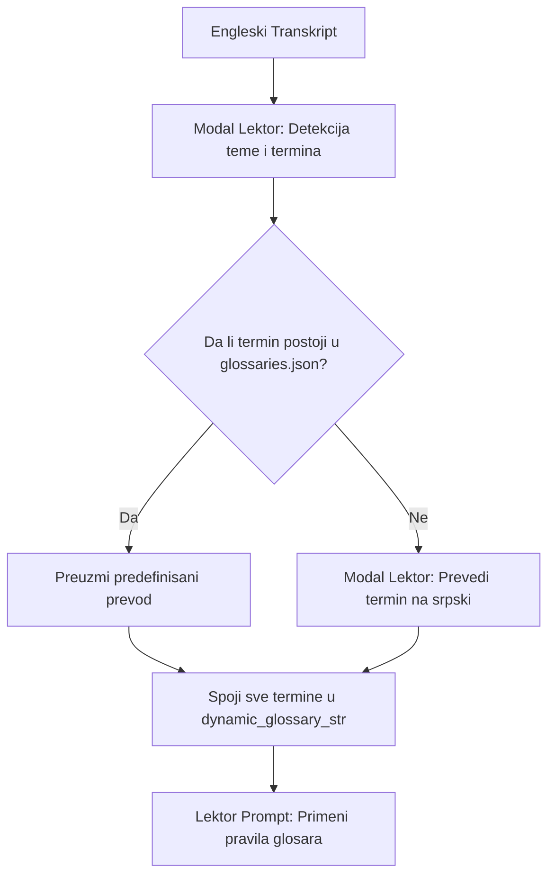

# 📖 Kako funkcioniše Glosar u Sinhronizuj.me?

Glosar (engl. *Glossary*) je specijalizovani modul unutar platforme **Sinhronizuj.me** koji obezbeđuje tačan, dosledan i prirodan prevod stručnih, tehničkih i žargonskih izraza sa engleskog na srpski jezik (ekavica, latinica). Njegova primarna svrha je da spreči LLM modele da doslovno (bukvalno) prevode specifičnu terminologiju.

---

## 📍 1. Gde se koristi?

Glosar je integrisan u **Fazu 1 (Asinhrona analiza videa)** i izvršava se u modulu za prevođenje i lekturu:
*   [backend/worker/translator.py](file:///home/gruya/Projektri/sinhronizuj.me/backend/worker/translator.py)

Poziva se neposredno pre pokretanja lekture teksta od strane Lektor modela (`qwen-lektor` na Modal serverless platformi).

---

## ⚙️ 2. Kako funkcioniše?

Sistem primenjuje **hibridni pristup** koji kombinuje preddefinisane (statičke) rečnike i dinamičko prepoznavanje tema i termina pomoću LLM-a.



### Detaljan opis koraka:

### Korak 2.1: Preddefinisani Rečnik (`glossaries.json`)
Sistem učitava rečnike iz datoteke [backend/worker/glossaries.json](file:///home/gruya/Projektri/sinhronizuj.me/backend/worker/glossaries.json). Ovi rečnici su ručno mapirani i podeljeni po tematskim kategorijama:
*   **Zanati i Zavarivanje (`welding_and_crafts`)**:
    *   `threaded rod` -> `navojna šipka`
    *   `angle grinder` -> `ugaona brusilica`
    *   `tack weld` -> `heftanje`
*   **Biologija i Priroda (`biology_and_nature`)**:
    *   `yellow fever` -> `žuta groznica`
    *   `breeding` -> `uzgoj`
*   **Tehnologija i IT (`technology_and_it`)**:
    *   `source code` -> `izvorni kod`
    *   `database` -> `baza podataka`

### Korak 2.2: Detekcija Teme i Termina (`detect_topic_and_terms`)
Pre početka prevoda celih rečenica, funkcija šalje kompletan engleski transkript videa Lektor modelu na Modalu. LLM analizira tekst i vraća strukturiran JSON odgovor koji sadrži:
*   **Glavnu temu videa** (`topic` - npr. `welding_and_crafts`)
*   **Listu ključnih stručnih termina** (`terms` - npr. `["thin square tubes", "welding rods"]`)

### Korak 2.3: Formiranje Dinamičkog Glosara (`get_dynamic_glossary`)
Sistem spaja pronađene termine sa statičkim bazama:
1.  **Provera statičke baze**: Za svaki detektovani termin se proverava da li postoji u nekoj od kategorija u `glossaries.json`. Ako postoji, uzima se predefinisani prevod.
2.  **LLM prevod nepoznatih termina (`translate_terms_to_serbian`)**: Ako termin nije u bazi, šalje se kratak upit Lektor modelu da stručno prevede taj pojam na srpski standardni jezik (ekavica, latinica), vodeći računa da se ne koriste arhaizmi ili hrvatski/bosanski/bugarski izrazi.
3.  **Spajanje**: Svi izvučeni i prevedeni termini se spajaju sa kompletnim rečnikom prepoznate tematske kategorije kako bi Lektor imao potpun kontekst.

### Korak 2.4: Primena u Lektor Promptu (`lektor_segments`)
Formirani glosar se ubacuje u prompt Lektora kao tekstualna lista:
```text
- "threaded rod" -> "navojna šipka"
- "angle grinder" -> "ugaona brusilica"
```
Lektor dobija striktnu instrukciju da obavezno koristi ove prevode, ali da ih **gramatički i morfološki prilagodi kontekstu rečenice** (npr. promeni padež, rod, broj, ili ga pretvori u odgovarajući glagolski oblik ako je u pitanju radnja).

---

## 💾 3. Korisnički Glosari u Bazi Podataka

Pored automatskog dinamičkog glosara koji radi u pozadini, sistem podržava i perzistentne korisničke glosare u bazi podataka:
*   **SQLAlchemy Model (`Glossary`)**: Definisan u [backend/core/models.py](file:///home/gruya/Projektri/sinhronizuj.me/backend/core/models.py#L64).
*   **Struktura tabele**:
    *   `id`: Primarni ključ.
    *   `user_id`: Strani ključ ka tabeli `User` (svaki korisnik ima svoj glosar).
    *   `english_word`: Reč na engleskom jeziku.
    *   `serbian_translation`: Prevod na srpski jezik.
*   **Buduća primena**: Ovaj model omogućava da se kroz korisnički interfejs (UI) ručno unesu specifična pravila prevođenja za određenog korisnika, koja će se ubuduće primenjivati pri svakoj analizi njegovih video snimaka.
