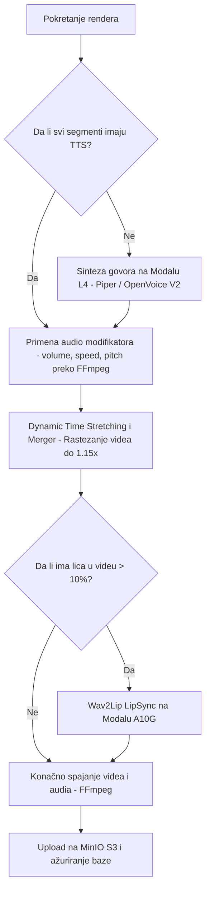

# 🎙️ Sinhronizuj.me — Detaljan Tok Pipeline-a (Arhitektura & Procesi)

**Sinhronizuj.me** koristi naprednu hibridnu cloud arhitekturu koja kombinuje **Control Plane** (Hetzner VPS) za orkestraciju i skladištenje, sa **Compute Plane** (Modal.com serverless GPU-ovi) za teške AI proračune.

Ovaj dokument detaljno opisuje kako se video zapisi analiziraju, prevode, lekturišu, sintetizuju i renderuju kroz naš dvoetapni asinhroni pipeline.

---

## 🗺️ Pregled Arhitekture Pipeline-a

Proces je podeljen na dve glavne asinkrone faze koje se izvršavaju preko Celery radnika na VPS-u, dok se između njih odvija interaktivni rad korisnika u React Studio interfejsu.

```mermaid
flowchart TD
    subgraph Faza 1: Analiza (analyze_video_task)
        A[Korisnik unosi URL] --> B[Preuzimanje Videa - Lokalno]
        B --> C[Separacija Audia - Demucs na Modalu T4]
        B --> D[Pozadinska Ekstrakcija Frejmova - Lokalno]
        C --> E[Ensemble STT - Whisper + SenseVoice na Modalu T4]
        E --> F[Multimodalni Prevod - Qwen2-VL na Modalu A10G]
        F --> G[Lektura + Dinamički Glosar - Qwen3-32B-AWQ na Modalu A10G]
        G --> H[Snimanje Nacrta - Redis Draft]
    end

    subgraph Studio Editor (Real-Time Rad)
        H --> I[Učitavanje u Studio UI]
        I --> J[Korisničke izmene prevoda / Čarobni štapić]
        I --> K[Podešavanje Volume / Tempo / Pitch / Ducking]
        I --> L[Realtime Preview - Hot-Patching Splicing]
    end

    subgraph Faza 2: Renderovanje (render_video_task)
        L --> M[Pokretanje Rendera]
        M --> N[Sinteza i Kloniranje Glasa - OpenVoice V2 na Modalu L4]
        N --> O[Primena FFmpeg Modifikatora - Volume/Tempo/Pitch]
        O --> P[Dynamic Time Stretching i Merger - Lokalno]
        P --> Q[Lip Sync - Wav2Lip na Modalu A10G]
        Q --> R[Upload Finalnog Videa - MinIO S3]
    end
```

---

## 🛠️ Detaljan Opis Koraka Pipeline-a

### 1. Faza 1: Asinhrona Analiza (`analyze_video_task`)
Ova faza započinje kada korisnik započne projekat unoseći video (YouTube link ili direktan upload). Cilj je izolovati zvuk, transkribovati ga, prevesti i pripremiti prvi lekturisani nacrt.

| Korak | Naziv Operacije | Hardver / GPU | Opis Tehnologije & Logika |
|---|---|---|---|
| **1.1** | **Preuzimanje Videa** | Lokalni VPS (CPU) | Preuzimanje videa preko `yt-dlp` ili dobavljanje iz MinIO skladišta. Datoteka se čuva u privremenom direktorijumu taska. |
| **1.2** | **Separacija Zvuka** | Modal (NVIDIA T4) | Pokreće se **Demucs** model. Ulazni audio se deli na vokalnu traku (`vocals.wav`) i pozadinsku muziku/efekte bez vokala (`no_vocals.wav`). |
| **1.3** | **Vizuelni Kontekst** | Lokalni VPS (CPU) | Paralelno sa separacijom, u pozadinskom threadu se izvlači 10 ključnih frejmova iz videa, pretvaraju u Base64 i uploaduju na MinIO kako bi poslužili kao multimodalni kontekst za prevodioca. |
| **1.4** | **Transkripcija (STT)** | Modal (NVIDIA T4) | Vokalna traka se normalizuje na `-20.0 dBFS` radi stabilnosti. **Whisper-large-v3** prepoznaje govor i generiše reč-po-reč vremenske oznake, dok **SenseVoice-Small** služi kao sekundarni ASR za detekciju interpunkcije, emocija i arbitražu kod nejasnih reči. |
| **1.5** | **Multimodalni Prevod** | Modal (NVIDIA A10G) | **Qwen2-VL-7B-Instruct** prima transkripciju i 10 izvučenih frejmova. Model prepoznaje rod govornika (muški/ženski), vizuelni kontekst i prevodi segmente na srpski jezik, čuvajući tačne tajminge. |
| **1.6** | **Dinamički Glosar & Lektura** | Modal (NVIDIA A10G) | **Qwen3-32B-AWQ** vrši lekturu. Najpre se analizira ceo transkript, prepoznaje tema i formira dinamički glosar (pomoću predefinisane baze [glossaries.json](file:///home/gruya/Projektri/sinhronizuj.me/backend/worker/glossaries.json) i LLM prevoda novih stručnih reči). Lektor ispravlja padeže, dijalektizme i ijekavicu. Na kraju se vrši programsko čišćenje (`to_latin` i `clean_translation_text`) radi eliminacije ijekavizama i loših prevoda. |
| **1.7** | **Kreiranje Drafta** | Lokalni VPS (Redis) | Rezultati se formatiraju u JSON sa svim metapodacima i čuvaju u Redis bazi pod ključem `project:{project_id}:draft` sa rokom važenja od 7 dana. |

---

### 2. Interaktivna Studio Faza (Korisnički Rad)
Korisnik učitava nacrt (draft) u **Studio Editor** koji nudi interaktivnu vremensku liniju i napredne alate:

*   **Podešavanje Zvuka po Segmentu:** Nezavisno kontrolisanje **Volume** (glasnoće), **Tempo** (brzine govora), **Pitch** (visine glasa) i **Ducking** (prigušenja pozadinske muzike tokom govora).
*   **Čarobni štapić (Magic Shorten):** Na klik na crveni segment (koji je predugačak za izgovor), poziva se Modal Lektor koji inteligentno skraćuje srpski tekst na optimalnu dužinu (`trajanje * 15` ili `trajanje * 20` karaktera) čuvajući suštinu rečenice.
*   **Realtime Preview (Hot-Patching Splicing):** Kada korisnik promeni tekst ili parametre na jednom segmentu, backend ne renderuje ceo video, već koristi **pydub** da generiše TTS samo za taj segment, iseče (slice) stari deo vokala, umetne novi na tačnu vremensku poziciju i vrati spojen audio u roku od 100-200ms.

---

### 3. Faza 2: Finalno Renderovanje (`render_video_task`)
Kada je korisnik zadovoljan prevodom i zvukom u Studiju, klikom na "Render" pokreće se finalno sklapanje.



#### Detaljan opis koraka Faze 2:
1.  **Sinteza Govora (TTS) i Kloniranje Glasa (Modal - L4 GPU):**
    *   Ako je izabran tip glasa `"clone"`, koristi se **OpenVoice V2** koji na osnovu kratkog isečka originalnog glasa iz videa klonira boju glasa i generiše srpski govor.
    *   Za standardne glasove koristi se optimizovan **Piper TTS** koji u deliću sekunde generiše prirodan srpski glas.
2.  **Primena Audio Modifikatora (Lokalni VPS):**
    *   Za svaki segment, na generisani wav fajl se primenjuju FFmpeg filteri: `rubberband` za promenu tempa i pitch-a, i `volume` za promenu glasnoće, shodno parametrima koje je korisnik podesio u Studiju.
3.  **Dynamic Time Stretching i Spajanje (Lokalni VPS):**
    *   Ukoliko je generisani srpski govor na nekom segmentu i dalje duži od originalnog engleskog trajanja (i nakon blagog ubrzavanja audia), pokreće se **Dynamic Time Stretching**.
    *   Sistem proračunava faktor rastezanja i pomoću FFmpeg-a **usporava video i pozadinsku muziku** na tom specifičnom mestu (maksimalno do 1.15x) kako bi se postigla savršena audio-video sinhronizacija bez prekidanja govora.
    *   Svi modifikovani audio segmenti se spajaju u `merged_vocals.wav`, a pozadinska muzika se stišava (**ducking**) na mestima gde ima govora.
4.  **LipSync Sinhronizacija (Modal - A10G GPU):**
    *   Sistem analizira video i proverava da li se lice govornika vidi u više od 10% frejmova.
    *   Ako je uslov ispunjen, video i spojeni srpski vokali se šalju na **Wav2Lip** model koji fotorealistično sinhronizuje pokrete usana govornika sa srpskim rečima.
5.  **Finalni Merge i Upload (Lokalni VPS):**
    *   FFmpeg spaja sinhronizovani video sa pozadinskom muzikom i vokalom u finalni MP4 format.
    *   Video se postavlja na MinIO S3 skladište u bucket `uploads/rendered`, a status projekta u bazi podataka se menja u `COMPLETED`.

---

## 📊 Korišćeni AI Modeli i Resursi

| Faza | AI Model | GPU na Modalu | Uloga u Sistemu |
|---|---|---|---|
| **Faza 1** | **Demucs v4** | NVIDIA T4 | Separacija vokala od pozadinske muzike |
| **Faza 1** | **Whisper-large-v3** | NVIDIA T4 | Transkripcija engleskog govora sa reč-po-reč tajminzima |
| **Faza 1** | **SenseVoice-Small** | NVIDIA T4 | Sekundarni ASR za emocije, interpunkciju i arbitražu |
| **Faza 1** | **Qwen2-VL-7B-Instruct**| NVIDIA A10G | Multimodalni prevod na srpski uz analizu frejmova |
| **Faza 1** | **Qwen3-32B-AWQ** | NVIDIA A10G | Lektura, dinamički glosar, ekavizacija, ti-forma |
| **Faza 2** | **Piper & OpenVoice V2**| NVIDIA L4 | Sinteza srpskog govora i kloniranje glasa govornika |
| **Faza 2** | **Wav2Lip** | NVIDIA A10G | Sinhronizacija pokreta usana sa srpskim audiom |
