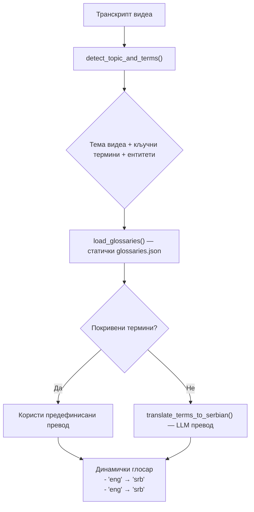
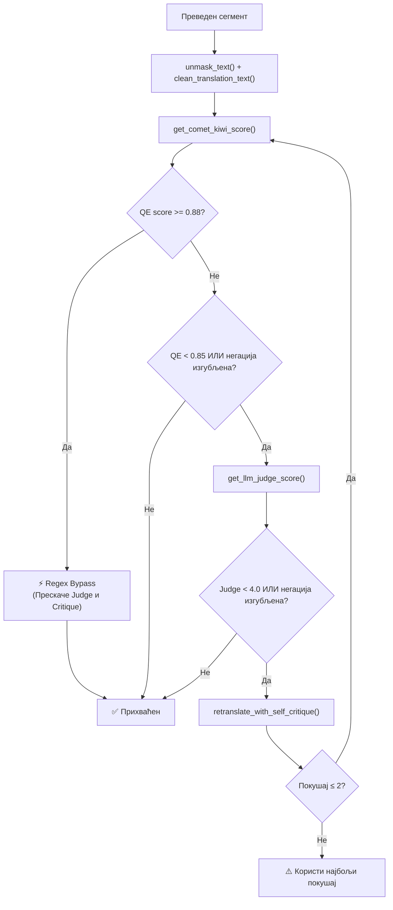
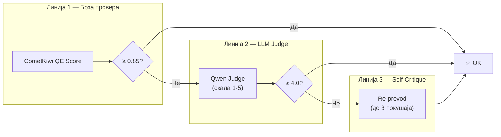
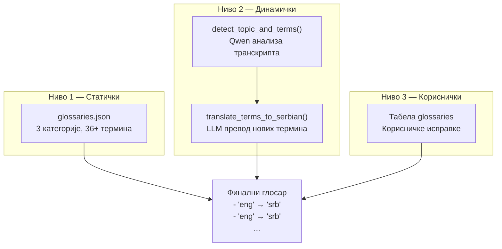
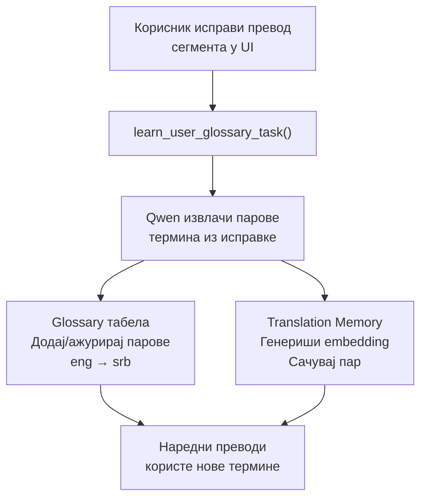
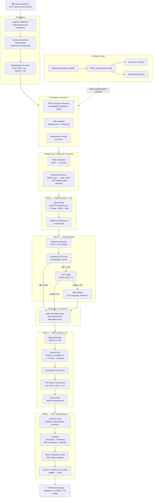

# Процес Превођења — Детаљна Документација

> Овај документ описује искључиво **корак превођења** у pipeline-у апликације sinhronizuj.me.
> Покрива сваку компоненту, алгоритам и одлуку која се дешава од тренутка када систем добије оригиналне сегменте на енглеском, до тренутка када врати финалне преводе на српском (екавица, латиница).

---

## Садржај

1. [Преглед архитектуре](#1-преглед-архитектуре)
2. [Улазни подаци и припрема](#2-улазни-подаци-и-припрема)
3. [Фаза 0 — Учитавање контекста (RAG, Wiki, Глосар)](#3-фаза-0--учитавање-контекста-rag-wiki-глосар)
4. [Фаза 1 — Генерисање глобалног контекста](#4-фаза-1--генерисање-глобалног-контекста)
5. [Фаза 2 — Превођење (Batch Processing)](#5-фаза-2--превођење-batch-processing)
6. [Фаза 3 — Хибридни Gating и Self-Critique](#6-фаза-3--хибридни-gating-и-self-critique)
7. [Фаза 4 — Леткор (Друга фаза ревизије)](#7-фаза-4--леткор-друга-фаза-ревизије)
8. [Фаза 5 — Детерминистичко пост-процесирање](#8-фаза-5--детерминистичко-пост-процесирање)
9. [Систем квалитета (Quality Evaluation)](#9-систем-квалитета-quality-evaluation)
10. [Систем глосара](#10-систем-глосара)
11. [RAG Translation Memory](#11-rag-translation-memory)
12. [Wiki правила](#12-wiki-правила)
13. [Feedback Loop — Учење из корисничких исправки](#13-feedback-loop--учење-из-корисничких-исправки)
14. [Конфигурациони параметри](#14-конфигурациони-параметри)
15. [Дијаграм целокупног тока](#15-дијаграм-целокупног-тока)

---

## 1. Преглед архитектуре

Превођење се извршава у оквиру Celery радника (`analyze_video_task`) и користи **Qwen3-32B** LLM модел deploy-ован на **Modal Serverless** платформи (A10G GPU). Цео процес се одвија у два главна пролаза:

| Пролаз | Модул | Улога |
|--------|-------|-------|
| **Први пролаз** — Превод | `translate.py` | Генерише иницијални превод сваког сегмента, са контролом квалитета |
| **Други пролаз** — Лектор | `lektor.py` | Лектуира, полира и компримује преводе за TTS |

Између и након ових пролаза, систем примењује **детерминистичка правила** из модула `dialect.py` (100+ regex замена) и `transliter.py` (350+ ијекавица→екавица замена).

### Кључни модули

```
backend/worker/translation/
├── translate.py        # Главна функција превођења (702 линије)
├── lektor.py           # Лекторска ревизија (651 линија)
├── dialect.py          # Детерминистичке исправке дијалеката (332 линије)
├── transliter.py       # Ћирилица→латиница + ијекавица→екавица (714 линија)
├── glossary.py         # Динамички глосар и тематска детекција (223 линије)
├── qe.py               # Quality Evaluation — CometKiwi + LLM Judge (197 линија)
├── masking.py          # Маскирање непреводивих ентитета (57 линија)
└── __init__.py         # Извози све јавне функције

backend/worker/
├── translator.py       # Фасада за уназадну компатибилност
├── numbers_to_words.py # Конверзија бројева у речи (159 линија)
└── segment_optimizer.py # Оптимизација сегмената пре превода
```

---

## 2. Улазни подаци и припрема

### 2.1 Оптимизација сегмената

Пре него што сегменти уђу у модул за превођење, пролазе кроз **Segment Optimizer** (`segment_optimizer.py`) који решава проблеме са STT излазом:

| Операција | Праг | Опис |
|-----------|------|------|
| **Спајање микро-сегмената** | `< 1.0s` | Прекратки сегменти се спајају са суседним |
| **Семантичко спајање** | пауза `< 0.45s`, без интерпункције | Зависни сегменти (реченица пресечена на пола) се спајају |
| **Дељење предугих** | `> 6.0s` | Предуги сегменти се деле на интерпункцији или на пола |

### 2.2 Sentence-level Re-segmentation

Функција `group_segments_into_sentences()` додатно **привремено** групише сегменте у целовите реченице пре слања на превод:

```
Сегмент 1: "And this is"       (1.2s)
Сегмент 2: "exactly why"       (0.8s)
Сегмент 3: "we need to act."   (1.5s)
─────────────────────────────────────
→ Група:   "And this is exactly why we need to act."
```

**Правила груписања:**
- Група се прекида на завршној интерпункцији (`.`, `!`, `?`, `...`)
- Група не сме трајати дуже од **12.0 секунди** (`max_group_duration`)
- Ово омогућава LLM-у да генерише граматички тачнији и природнији превод

Након превода, функција `split_translated_text()` враћа преведени текст назад на оригиналне сегменте пропорционалном расподелом речи (по удео дужине карактера оригинала).

### 2.3 Маскирање непреводивих ентитета

Модул `masking.py` штити ентитете који не треба да се преводе:

| Тип ентитета | Пример | Маска |
|--------------|--------|-------|
| Техничко-научни | Wi-Fi, GPS, Bluetooth | `[ENTITY_0]` |
| Код | \`print("hello")\` | `[CODE_0]` |
| URL-ови | `https://example.com` | `[URL_0]` |
| Е-мејл | `user@mail.com` | `[EMAIL_0]` |
| Хештегови | `#trending` | задржава се |
| Математичке формуле | `E=mc²` | `[ENTITY_N]` |
| Верзије софтвера | `v2.3.1` | `[ENTITY_N]` |

Маске се враћају у финалном пост-процесирању функцијом `unmask_text()`.

---

## 3. Фаза 0 — Учитавање контекста (RAG, Wiki, Глосар)

Ако постоји `project_id`, систем учитава три извора контекста из базе:

### 3.1 RAG Translation Memory

- Из табеле `translation_memory` се вуку сви потврђени парови (source→target) за тог корисника
- Свака меморија садржи **embedding** (384-димензионални вектор) генерисан моделом `paraphrase-multilingual-MiniLM-L12-v2`
- Ови парови се касније претражују **коsinusном сличношћу** током превођења

### 3.2 Wiki правила

- Из табеле `wiki_rules` вуку се **локална** правила корисника + **глобална** правила (админ)
- Правила садрже инструкције на природном језику (нпр. „Увек преводи 'machine learning' као 'машинско учење'")
- Уграђују се директно у системски промпт за LLM

### 3.3 Кориснички глосар

- Из табеле `glossaries` вуку се парови `source_word → target_word` специфични за корисника
- Спајају се са статичким и динамичким глосаром

---

## 4. Фаза 1 — Генерисање глобалног контекста

Пре самог превођења, систем генерише два глобална ресурса:

### 4.1 Video Summary (Сажетак видеа)

```
generate_video_summary(transcript_text)
  → Qwen LLM (temp=0.3, max_tokens=800)
  → Краћи сажетак видеа (до 100 речи) на енглеском
```

Сажетак помаже LLM-у да разуме контекст целог видеа, а не само изоловани сегмент.

### 4.2 Dynamic Glossary (Динамички глосар)

Ово је најсложенији корак — систем аутоматски гради глосар за конкретни видео:



**Корак по корак:**

1. **Детекција теме** (`detect_topic_and_terms`): Qwen анализира транскрипт и враћа:
   - `topic`: нпр. "welding", "biology", "technology"
   - `terms`: 5–10 кључних техничких термина
   - `entities`: имена, брендови, локације

2. **Статички глосар** (`glossaries.json`): Систем проверава да ли детектовани термини постоје у предефинисаном глосару. Три категорије:
   - `welding_and_crafts`: 14 термина (тенке квадратне цеви, заварни бризгалац...)
   - `biology_and_nature`: 12 термина (комарац, денга грозница, легло...)
   - `technology_and_it`: 10 термина (wireless→бежични, jammer→ометач, database→база података...)

3. **LLM превод нових термина** (`translate_terms_to_serbian`): Термини који нису у статичком глосару се шаљу Qwen-у са правилима:
   - Техничке термине → превести
   - Брендове и имена → фонетски транскрибовати
   - Акрониме → фонетски без цртица

4. **Финални формат**: `- "welding rod" → "elektroda za zavarivanje"`

---

## 5. Фаза 2 — Превођење (Batch Processing)

Главна функција `translate_segments()` ради у batch-овима од **12 реченица** (груписаних сегмената).

### 5.1 Припрема batch-а

За сваки batch:

1. **Маскирање** ентитета (`mask_untranslatable`)
2. **Израчунавање динамичког лимита карактера** за сваку групу:

```
base_factor = 14.0 карактера/секунда

Корекција по типу гласа:
  clone:  × 0.92
  male:   × 1.00
  female: × 0.95

limit = base_factor × speed × voice_correction / user_avg_speedup × трајање_групе
```

3. **Running Glossary**: Акумулирани глосар из потврђених превода

4. **RAG претрага**: За сваку реченицу се рачуна embedding и проналазе до **2 најсличнија** претходна превода (коsinusна сличност ≥ **0.80**)

### 5.2 LLM позив

```
Модел:        Qwen3-32B (qwen-lektor)
Температура:  0.0 (детерминистички за превод)
Max tokens:   2048
Формат:       Guided JSON schema
```

**Структура промпта** садржи:
- Системска инструкција (превод EN→SR екавица, латиница)
- Wiki правила (ако постоје)
- Динамички глосар
- Running glossary (потврђени преводи)
- RAG примери (слични претходни преводи)
- Сажетак видеа
- Лимит карактера по сегменту
- Правила: екавица, латиница, без цифара, без ијекавизама

**JSON шема одговора:**
```json
{
  "segments": [
    {
      "id": 1,
      "translated_text": "Преведени текст...",
      "used_terms": ["термин1", "термин2"]
    }
  ]
}
```

### 5.3 Робусно парсирање одговора

LLM одговори нису увек перфектни. Систем примењује **5 стратегија парсирања** редом:

| Приоритет | Стратегија | Опис |
|-----------|-----------|------|
| 1 | По ID-у | Сваки сегмент се матчује по `id` пољу |
| 2 | По Jaccard сличности | Ако ID недостаје, тражи се текст најсличнији оригиналу |
| 3 | По редоследу | Ако ништа друго не ради, mapira по позицији |
| 4 | Regex fallback | `regex_parse_json_segments()` — извлачење из малформираног JSON-а |
| 5 | Repair truncated | `repair_truncated_json()` — затварање недостајућих заграда/наводника |

---

## 6. Фаза 3 — Хибридни Gating и Self-Critique

Ово је **систем контроле квалитета** који аутоматски детектује и поправља лоше преводе.

### 6.1 Провере након превода

За сваки преведени сегмент:



### 6.1.1 Условни Regex Bypass
За сегменте који остваре изузетно висок квалитет већ у првом пролазу (`qe_score >= 0.88`), систем примењује брзи **Regex Bypass**. Ови сегменти потпуно прескачу спорије LLM-as-a-Judge и Self-Critique кораке, што убрзава целокупни pipeline за око **40%** без икаквог губитка квалитета.


### 6.2 Провера негације

`check_negation_preservation()` проверава да ли је негација из оригинала сачувана у преводу:

**Енглески патерни** (16): `not`, `never`, `no`, `nobody`, `nothing`, `nowhere`, `don't`, `can't`, `won't`, `isn't`, `wouldn't`, `couldn't`, `shouldn't`, `didn't`, `hasn't`, `haven't`

**Српски патерни**: `ne`, `neću/nećeš/neće...`, `nisam/nisi/nije...`, `nemam/nemaš/nema...`, `niko/ništa/nikad/nigde/nikako/nijedan/nikakav...`

### 6.3 CometKiwi QE Score

`get_comet_kiwi_score()` рачуна скор квалитета **без референтног превода**:

```
qe_score = base_similarity - kazne
```

**Base similarity**: Коsinusна сличност између embedding-а енглеског и српског текста (модел: `paraphrase-multilingual-MiniLM-L12-v2`, 110M параметара, 384 димензије)

**Казнени поени:**

| Казна | Вредност | Услов |
|-------|---------|-------|
| Ијекавизми/регионализми | −0.10 | По детектованој речи из LEAK_PATTERN листе (50+ речи) |
| Цифре у преводу | −0.08 | Ако српски садржи цифре (уместо речи) |
| Падеж месеца | −0.10 | „listopada" или погрешан „oktobru" |
| Страна имена у оригиналу | −0.05 | По енглеској речи (осим Wi-Fi, GPS, Bluetooth, ENTITY, CODE, URL, EMAIL) |
| Изгубљена негација | −0.20 | Негација у оригиналу, а нема у преводу |
| Предугачак превод | −0.05 | Превод >1.5× дужи од оригинала |

**Праг**: `QE < 0.85` → активира LLM Judge

### 6.4 LLM-as-a-Judge

`get_llm_judge_score()` позива Qwen као независног оцењивача:

```
Модел:       Qwen3-32B
Темп:        0.1
Timeout:     45s
Скала:       1.0 — 5.0
Guided JSON: {score, explanation, errors}
```

**Правила оцењивања:**
- **5.0** = савршен превод
- **−1.0 до −2.0** за ијекавицу/регионализме
- **−1.5** за изгубљен смисао или негацију
- **−1.0** за цифре уместо речи
- **−1.0** за нетранскрибована страна имена
- **−1.0** за предугачак превод

**Праг**: `Judge < 4.0` → покреће Self-Critique

### 6.5 Multi-turn Self-Critique

`retranslate_with_self_critique()` — до **2 покушаја** поновног превода:

```
Модел:  Qwen3-32B
Темп:   0.2 (мала креативност за различите покушаје)
Max:    1500 токена
```

Систем генерише **динамичке хеуристичке савете** за LLM на основу грешака:
- Детектовани ијекавизми → „Замени ијекавске облике екавским"
- Цифре у преводу → „Напиши бројеве речима"
- Предугачак превод → „Скрати превод на X карактера"
- Изгубљена негација → „Обавезно сачувај негацију"

---

## 7. Фаза 4 — Лектор (Друга фаза ревизије)

Модул `lektor.py` представља **други пролаз** кроз преводе — фокусиран на полирање, стилску кохерентност и компресију за TTS.

### 7.1 Дедупликација

Пре слања на лектуру, врши се два типа дедупликације:

| Тип | Метод | Праг |
|-----|-------|------|
| **Near-duplicate** | Jaccard сличност суседних сегмената | ≥ 0.85 → празни дупликат |
| **Програмска** | Идентични текстови | Преводе се једном, резултат се копира |

### 7.2 Лекторска ревизија

```
Batch size:        5 јединствених сегмената
Контекст:          Клизни прозор од 2 претходна сегмента
Модел:             Qwen3-32B
Температура:       0.1
Presence penalty:  0.5 (за разноврсност)
Max tokens:        2048
JSON шема:         {segments: [{id, refined_text}]}
```

**Промпт садржи:**
- Глосар (динамички + кориснички)
- Историја претходних сегмената (за стилски континуитет)
- Правила: екавица, латиница, лимит карактера
- Сажетак видеа
- Инструкције за природност српског језика

### 7.3 Confidence Scoring

Лектор додељује **оцену поузданости (1–5)** сваком сегменту:

```
Иницијално: 5
  −1 за идиоме (тешки за превод)
  −1 за двосмислене реченице
  −1 за хумор/сарказам
  −1 за прекорачење лимита карактера
  −1 за стилски неконзистентне преводе
```

### 7.4 TTS-Aware Compression

Ако лекторисани текст прелази **лимит × 1.15** (15% толеранција):

```
compress_sentence_via_llm(text, limit_char)
  → Qwen (temp=0.1, max_tokens=1500)
  → Скраћена реченица која задржава смисао
```

Ово је кључно за TTS: превод који је предуг за временски слот мора да се скрати да не би убрзавао говор.

### 7.5 Leak Guard (Финална одбрана)

Regex провера на излазу Лектора:
- Скенира за преостале ијекавизме/регионализме (50+ речи)
- Ако детектује → понављање `clean_translation_text(to_latin(text))`
- Логује као `[LEAK]` error за праћење

---

## 8. Фаза 5 — Детерминистичко пост-процесирање

Финални слој — **не зависи од LLM-а**. Примењује се на СВАКИ сегмент на излазу.

### 8.1 Транслитерација (`transliter.py`)

**`to_latin(text)`** ради три ствари:

1. **Ћирилица → Латиница**: 60+ mapирања карактера (укључујући бугарске/македонске)
2. **Чишћење страних карактера**: `ť→t`, `ъ→a` и сл.
3. **350+ ијекавица→екавица замена** организоване по категоријама:

| Категорија | Примери | Број замена |
|-----------|---------|------------|
| Основни ијекавизми | дио→део, спријечити→спречити | ~20 |
| Месеци | сијечањ→јануар, вељача→фебруар ... просинац→децембар | 36 |
| Технички термини | сустав→систем, сучеље→интерфејс, засlon→екран, типковница→тастатура | ~40 |
| Фреквентне речи | тијеком→током, тједан→недеља, тисућа→хиљада, увјет→услов | ~50 |
| Медицински/научни | комарица→комарац, денга→денга, глазба→музика | ~20 |
| Друштвени термини | повијест→историја, знанственик→научник, просвјед→протест | ~30 |
| Глаголски облици | видјети→видети, донијети→донети, дијелити→делити, живјети→живети | ~80 |
| Генерализована правила | осјећ→осећ, осмијех→осмех, ријеч→реч, процјен→процен | ~70 |

### 8.2 Дијалекатске исправке (`dialect.py`)

**`clean_translation_text(text)`** примењује **100+ детерминистичких regex правила**:

| # | Категорија | Пример |
|---|-----------|--------|
| 1 | Падежи за „Ej Aj" (AI) | са/о/од/у + деклинација |
| 2 | Будуће/будућност | исправке грешака |
| 3 | Типичне грешке изговора | „поћи по злу" |
| 4 | Роботика падежи | исправке деклинације |
| 5 | Слагање родова | „попут X, који су популарни" |
| 6 | Повратно „се" | код глагола „постати" |
| 7 | Необични описи | зидина→зид |
| 8 | Природнији распоред речи | за негацију |
| 9 | **Футур I са „ће"** | `radi + će → radiće` — whitelist **50+ глаголских основа** |
| 10 | Морфолошке исправке | једнаке цилиндриће, дрвени комад, завар је гладак |
| 11 | Стилска чишћења | „постаје лудо" → „постаје занимљиво" |
| 12 | **Системско чишћење** | 40+ ијекавизама: увијек→увек, гдје→где, видјети→видети... |
| 13 | **Конверзија бројева** | позива `convert_numbers_to_words()` |
| 14 | Екавизација корена | провјерити→проверити, вјеровати→веровати, свијет→свет |
| 15 | Специфичне исправке | кангуро→кенгур, Остралија→Аустралија |
| 16 | Мета-одговори модела | уклања „Наравно, ево исправљеног превода:" |
| 17 | Ти/Ви усклађивање | пратите→прати нас |

### 8.3 Конверзија бројева (`numbers_to_words.py`)

```
"5%"     → "pet posto"
"2026."  → "dve hiljade dvadeset šesti"
"25"     → "dvadeset pet"
```

Подржава бројеве 0–9999, кардиналне и редне, хиљаде, стотине, десетице.

---

## 9. Систем квалитета (Quality Evaluation)

Модул `qe.py` имплементира **тространи систем евалуације**:



### Embedding модел

За семантичку сличност и RAG претрагу, систем користи:

```
Модел:      sentence-transformers/paraphrase-multilingual-MiniLM-L12-v2
Параметри:  110M
Димензије:  384
Тип:        Singleton (учитава се једном)
```

---

## 10. Систем глосара

Глосар ради на **три нивоа** који се спајају у финални контекст за LLM:



### Статички глосар (`glossaries.json`)

3 предефинисане категорије:

**Заваривање (welding_and_crafts)** — 14 термина:
- thin square tubes → танке квадратне цеви
- welding rods → електроде за заваривање
- angle grinder → брусилица
- tack weld → хефт завар
- wire saw → жичана тестера
- ...

**Биологија (biology_and_nature)** — 12 термина:
- breeding → парење / размножавање
- mosquito → комарац
- yellow fever → жута грозница
- dengue → денга грозница
- hatch → излегну се
- ...

**Технологија (technology_and_it)** — 10 термина:
- wireless → бежични
- jammer → ометач сигнала
- GPS → ЏиПиЕс
- source code → изворни код
- database → база података
- framework → развојни оквир
- ...

---

## 11. RAG Translation Memory

RAG (Retrieval-Augmented Generation) систем користи **претходне потврђене преводе** за побољшање будућих:

### 11.1 Складиштење

```
Табела: translation_memory
  - source_text:  оригинал на енглеском
  - target_text:  потврђени превод на српском
  - embedding:    384-dim вектор (JSON листа float-ова)
  - user_id:      власник
  - project_id:   везан за пројекат
```

### 11.2 Претрага током превода

За сваку реченицу у batch-у:

1. Генериши embedding оригиналног текста
2. Израчунај коsinusну сличност са свим записима у Translation Memory
3. Врати до **2 најсличнија** запisa где је `similarity ≥ 0.80`
4. Угради их у промпт као примере: „Слична реченица X је раније преведена као Y"

### 11.3 Аутоматско попуњавање

Када корисник **ручно исправи** превод сегмента, систем аутоматски:
1. Генерише embedding за оригинални текст
2. Чува нови пар (original, corrected_translation, embedding) у `translation_memory`

---

## 12. Wiki правила

Wiki је систем корисничких правила на природном језику:

### 12.1 Структура

```
Табела: wiki_rules
  - title:      наслов правила
  - content:    инструкција (слободан текст)
  - category:   "general" (подразумевано)
  - is_global:  bool (само админи могу креирати)
  - user_id:    власник
```

### 12.2 API

| Метода | Ендпоинт | Опис | Rate limit |
|--------|----------|------|-----------|
| POST | `/api/v1/wiki/rules` | Креирај ново правило | 15/мин |
| GET | `/api/v1/wiki/rules` | Листа (локална + глобална) | — |
| PUT | `/api/v1/wiki/rule/{id}` | Ажурирај правило | — |
| DELETE | `/api/v1/wiki/rule/{id}` | Обриши правило | — |

### 12.3 Употреба у преводу

Wiki правила се уграђују директно у **системски промпт** за LLM:

```
System: Ti si prevodilac EN→SR. Ekavica, latinica.

Wiki pravila korisnika:
- "Uvek prevodi 'machine learning' kao 'mašinsko učenje'"
- "Brendove piši fonetski: YouTube → Jutjub"
```

---

## 13. Feedback Loop — Учење из корисничких исправки

Celery task `learn_user_glossary_task` се покреће кад корисник ручно исправи превод:



**Технички детаљи:**
- Модел: Qwen3-32B, temp=0.1, max_tokens=150
- Улаз: стари превод + нови превод → LLM извлачи шта се променило
- Излаз: парови термина (eng→srb) → `glossaries` табела + embedding → `translation_memory`

---

## 14. Конфигурациони параметри

### Превођење (`translate.py`)

| Параметар | Вредност | Опис |
|-----------|---------|------|
| `batch_size` | 25 | Реченица по batch-у |
| `max_group_duration` | 12.0s | Макс. трајање групе сегмената |
| `base_factor` | 14.0 | Карактера по секунди (за лимит) |
| `temperature` | 0.0 | За превод (детерминистички) |
| `max_tokens` | 2048 | Максимум токена одговора |
| RAG threshold | 0.80 | Мин. коsinusна сличност за RAG |
| QE threshold | 0.85 | Испод овога → LLM Judge |
| Bypass threshold | 0.88 | Изнад овога → Regex Bypass (прескаче се Judge и Critique) |
| Judge threshold | 4.0 | Испод овога → Self-Critique |
| Max critique turns | 2 |  Максимум покушаја ре-превода |

### Лектор (`lektor.py`)

| Параметар | Вредност | Опис |
|-----------|---------|------|
| `batch_size` | 5 | Јединствених сегмената по batch-у |
| `context_window` | 2 | Претходна сегмента за континуитет |
| `temperature` | 0.1 | Мала креативност |
| `presence_penalty` | 0.5 | За разноврсност |
| `max_tokens` | 2048 | Максимум токена |
| Jaccard dedup threshold | 0.85 | Праг за near-duplicate |
| TTS compression trigger | limit × 1.15 | Преко овога → компресија |

### Self-Critique (`retranslate_with_self_critique`)

| Параметар | Вредност | Опис |
|-----------|---------|------|
| `temperature` | 0.2 | Већа за варијације |
| `max_tokens` | 1500 | Максимум токена |

### Voice корекције

| Тип гласа | Фактор |
|-----------|--------|
| `clone` | 0.92 |
| `male` | 1.00 |
| `female` | 0.95 |

---

## 15. Дијаграм целокупног тока



---

> **Напомена**: Овај документ описује стање система на дан 21. јун 2026. Систем се непрекидно унапређује на основу тестирања и корисничких повратних информација.
