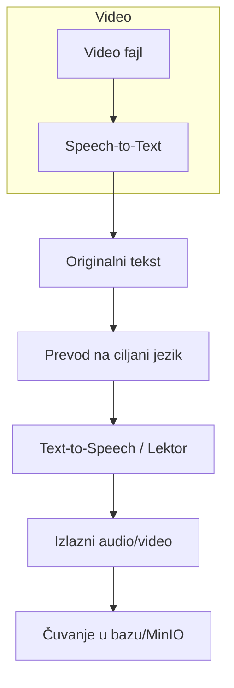

# Proces Prevođenja u sinhronizuj.me

## Pregled

Aplikacija **sinhronizuj.me** omogućava automatski prevod video i audio sadržaja. Ceo proces se sastoji od sledećih faza:

1. **Učitavanje video fajla** – korisnik otpremi video u sistem ili odabere postojeći iz skladišta.
2. **Speech‑to‑Text (STT)** – audio iz videa se prosleđuje servisu za automatsko prepoznavanje govora (npr. Whisper) i dobija se **originalni tekst**.
3. **Prevod** – originalni tekst se prosleđuje LLM‑modelu (npr. MarianMT / custom‑model) i dobija se **prevod** na željeni jezik.
4. **Text‑to‑Speech (TTS) ili lektor** – prevedeni tekst se konvertuje nazad u audio (TTS) ili se šalje ljudskom lektoru radi finalnog pregleda. 
5. **Skladištenje** – finalni rezultat (video sa sinhronizovanim titlovima ili audio fajl) se čuva u MinIO / PostgreSQL za dalju upotrebu.

## Detaljan tok podataka

## Komponente

| Komponenta | Tehnologija | Opis |
|------------|-------------|------|
| **Backend API** | FastAPI | Orkestrira celi radni tok, prima zahteve i vraća status zadataka. |
| **Celery Radnici** | Celery + Redis | Asinkrono izvršavaju STT, prevod i TTS. |
| **STT servis** | OpenAI Whisper (lokalno) | Pretvara govor u tekst. |
| **Prevod model** | MarianMT / custom‑LLaMA | Generiše prevod teksta. |
| **TTS servis** | Coqui TTS / Google Cloud TTS | Pretvara prevedeni tekst u audio. |
| **Skladište** | MinIO + PostgreSQL | Čuva originalni i prevedeni sadržaj, meta‑podatke. |
| **Frontend** | React + Vite | UI za upload, pregled rezultata i korekciju titlova. |

## Mogućnosti proširenja

- **RAG‑baziran wiki** – automatsko korišćenje internog wikija za dodatni kontekst pri prevođenju.
- **Korisnički ispravci** – ručno ispravljeni prevodi se mogu upisivati u globalni glosar i koristiti u budućim zadacima.

---

*Ovaj dokument je generisan automatski od strane Antigravity asistenta.*
