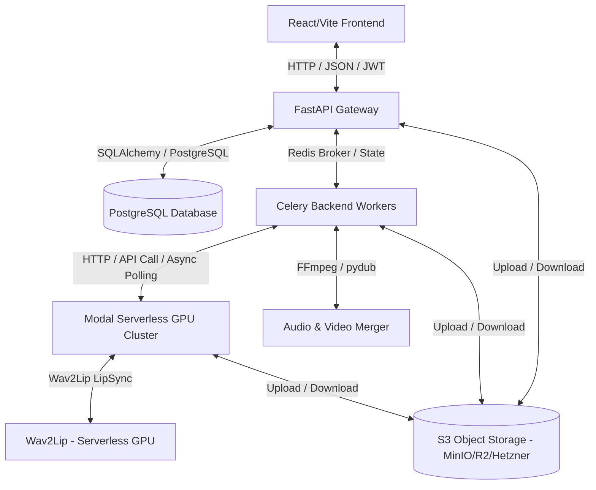

# Arhitektura Sistema i Tok Podataka

Ovaj dokument pruža detaljan tehnički pregled arhitekture sistema platforme **sinhronizuj.me** i njenog toka podataka.

## Povezane Beleške
*   [[00_MOC_Index]]
*   [[Baza_Podataka]]
*   [[Backend_Dokumentacija]]
*   [[Modal_Workers_i_AI]]

---

## 1. Troslojna Arhitektura Sistema

Platforma se zasniva na troslojnoj (3-tier) distribuiranoj arhitekturi, optimizovanoj za rukovanje teškim audio/video procesiranjem i serverless AI operacijama:

### Slojevi sistema:
1.  **Klijentski sloj (Frontend)**: React.js aplikacija izgrađena pomoću Vite-a. Komunicira sa FastAPI backendom preko REST API-ja. Koristi JWT autentifikaciju za bezbedan pristup resursima. Vidi detaljnije na [[Frontend_Dokumentacija]].
2.  **Aplikacioni / Orkestracioni sloj (Backend & Celery)**:
    *   **FastAPI API Gateway**: Modularni ruter koji prihvata zahteve klijenata, upravlja sesijama, validira podatke preko Pydantic šema, generiše S3 upload URL-ove, primenjuje kvote i limite i šalje dugotrajne poslove (analiza, renderovanje) u asinhroni red. Vidi detaljnije na [[Backend_Dokumentacija]].
    *   **Celery Workers (Host mašina)**: Pokreću se na CPU resursima host servera. Koriste Redis kao broker sa AOF perzistencijom. Zaduženi su za orkestraciju poslova obrade videa, preuzimanje fajlova, lokalno procesiranje i spajanje audia/videa pomoću FFmpeg/pydub biblioteka.
3.  **AI Računarski sloj (Modal Serverless GPU)**:
    *   Modal serverless klaster koji se dinamički skalira (scale-to-zero) i koristi GPU instance po potrebi (T4, A10G, L4 ili A100).
    *   Izvršava modele za prepoznavanje govora (SenseVoice / Faster-Whisper), razdvajanje audio izvora (Demucs), mašinsko prevođenje (Qwen2-VL), lekturu (Qwen3), glasovnu sintezu sa kloniranjem (Piper + OpenVoice v2) i vizuelni lipsync (Wav2Lip). Vidi detaljnije na [[Modal_Workers_i_AI]].

---

## 2. Tok Podataka i Komunikacija

Tokom procesa sinhronizacije videa, podaci prolaze kroz sledeće faze:

1.  **Faza Inicijalizacije i Upload-a**:
    *   Korisnik na frontendu bira video fajl.
    *   Frontend traži potpisan URL za direktan upload na S3 skladište od FastAPI-ja (`GET /api/v1/storage/upload_url`).
    *   Video se bezbedno šalje direktno na S3 iz klijenta radi izbegavanja opterećenja API gateway-a.
2.  **Faza Analize Videa**:
    *   Nakon upload-a, klijent poziva `POST /api/v1/process-video` inicirajući Celery zadatak `analyze_video_task`.
    *   Celery radnik preuzima video sa S3, poziva **Modal Demucs** worker za izolaciju vokala od pozadinske buke.
    *   Nakon toga, izolovani vokali se šalju na **Modal SenseVoice STT** za transkripciju sa vremenskim kodovima.
    *   Tekst se prevodi na srpski pomoću **Modal Translator**-a (koji primenjuje korisnički definisane glosare za konzistentnost).
    *   Rezultujući segmenti se upisuju u PostgreSQL bazu, a status projekta prelazi u `ready`. Vidi više o modelima u [[Baza_Podataka]].
3.  **Faza Uređivanja (Studio DAW)**:
    *   Korisnik u realnom vremenu modifikuje prevod, podešava jačinu originalnog glasa, pozadinske muzike i sintetizovanog govora, menja brzinu reprodukcije i vrstu glasa (npr. klonirani ili generički muški).
    *   Svaka izmena se skladišti u PostgreSQL-u i lokalnom undo/redo steku klijenta.
4.  **Faza Sinteze i Renderovanja**:
    *   Kada klijent zatraži pregled segmenta ili finalni render, backend poziva **Modal OpenVoice/TTS** koji generiše srpski audio fajl na osnovu prenesenog teksta, brzine i glasa izdvojenog iz originalnih vokala (kloniranje).
    *   Za finalni render (`render_video_task`), Celery radnik kombinuje sve sintetizovane audio segmente, vrši njihovo vremensko uklapanje i miksovanje sa pozadinskim zvukom (no-vocals audio) u optimalnom omjeru jačine, a zatim spaja dobijeni audio sa video trakom pomoću FFmpeg-a. Finalni fajl se otprema na S3.
