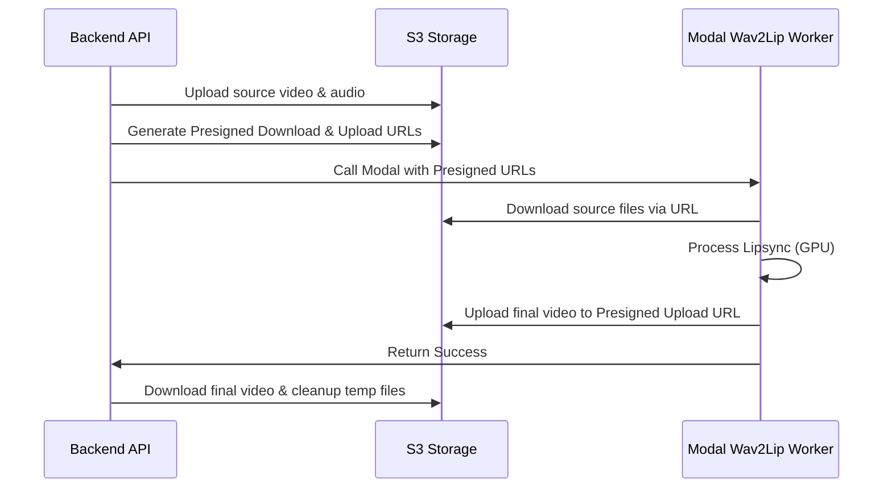

# Sistemske Optimizacije (Sprovedene Optimizacije i Otklonjene Slabosti)

Ovaj dokument pruža detaljan pregled sistemskih i arhitektonskih optimizacija koje su uspešno implementirane na platformi **sinhronizuj.me** kroz Faze 1, 2, 3 i 4.

## Povezane Beleške
*   [[00_MOC_Index]]
*   [[Arhitektura_MOC]]
*   [[Performanse_i_SLA]]
*   [[Prevodilacki_Pipeline]]

---

## 🚀 Pregled Sprovedenih Optimizacija po Fazama

### 1. Faza 1: Kritična Stabilnost, Konkurentnost i I/O Performanse

#### Otklanjanje Race Condition-a u Celery Radnicima
*   **Problem:** U prethodnoj arhitekturi, globalna konfiguracija `settings.TEMP_WORKSPACE` je predefinisana unutar Celery zadataka, što je stvaralo deljeni resurs i dovodilo do prepisivanja podataka i race condition-a kada su se dva videa analizirala ili renderovala istovremeno.
*   **Rešenje:** Uklonjeno je globalno predefinisanje iz [tasks.py](file:///home/gruya/Projektri/sinhronizuj.me/backend/worker/tasks.py). Uveden je lokalno izolovani direktorijum na osnovu jedinstvenog `task_id` (npr. `/tmp/workspace_<task_id>`) koji se prosleđuje kroz ceo pipeline kao parametar `workspace_path`.

#### Rešavanje Curenja Diska (Disk Leaks)
*   **Problem:** Padovi u fazama analize ili rendera ostavljali su stotine megabajta privremenih audio i video isečaka u temp direktorijumima, što je pretilo da popuni produkcioni disk.
*   **Rešenje:** Integrisan je robustan `try...finally` blok u zadatke `analyze_video_task` i `render_video_task` koji garantuje brisanje celog privremenog `task_workspace` foldera nakon uspeha ili neuspeha. U [merger.py](file:///home/gruya/Projektri/sinhronizuj.me/backend/worker/merger.py) je dodat mehanizam koji uvek čisti privremene ubrzane isečke.

#### Batch Pre-computation u Active Speaker Detekciji
*   **Problem:** Analiza govornika na ekranu u [active_speaker.py](file:///home/gruya/Projektri/sinhronizuj.me/backend/worker/active_speaker.py) je bila ekstremno spora (preko 20 minuta) jer se za svaki govorni segment otvarao video fajl i radilo se FFmpeg seek-ovanje, što je skupo na kompresovanim fajlovima.
*   **Rešenje:** Implementirana je funkcija `precompute_active_speakers()` koja skenira video u jednom sekvencijalnom prolazu, kešira FaceMesh rezultate u memorijski timeline, dok se za pojedinačne segmente vrši trenutno filtriranje iz timeline-a. **Ubrzanje detekcije iznosi preko 100x.**

---

### 2. Faza 2: Asinhroni API i Memorijska Stabilnost

#### Asinhroni TTS za DAW Studio
*   **Problem:** Generisanje zvuka (TTS) se na API-ju vršilo sinhrono. Za duže transkripte, klijent je čekao i preko 60 sekundi što je dovodilo do `504 Gateway Timeout` grešaka na Nginx proxy-ju.
*   **Rešenje:** TTS rute u [segments.py](file:///home/gruya/Projektri/sinhronizuj.me/backend/routes/segments.py) su prebačene na asinhroni Celery režim. API odmah vraća `task_id`, dok Celery radnici u pozadini obrađuju sintezu i ažuriraju Redis i bazu.

#### S3 Pre-signed URL Prenos za Wav2Lip
*   **Problem:** Prenos slika i video frejmova ka Modal serverless radnicima vršio se preko JSON-a u Base64 formatu. Ovo je prouzrokovalo ogroman overhead u memoriji i mrežnom prenosu (OOM rizici na API gateway-u).
*   **Rešenje:** Uveden je prenos preko S3 presigned URL-ova. Backend u [lipsync.py](file:///home/gruya/Projektri/sinhronizuj.me/backend/worker/lipsync.py) otprema video i audio na S3, generiše presigned download i upload URL-ove i prosleđuje ih [wav2lip_worker.py](file:///home/gruya/Projektri/sinhronizuj.me/modal_workers/wav2lip_worker.py) na Modalu, koji rezultat otprema direktno na S3 bez Base64 posrednika.

---

### 3. Faza 3: Optimizacija Treninga i Baze Podataka

#### NFS Keširanje za fine-tuning
*   **Problem:** Svako pokretanje LoRA treninga na Modalu je preuzimalo težak Qwen 32B model sa HuggingFace-a ispočetka, trošeći vreme i propusni opseg.
*   **Rešenje:** Konfigurisan je NFS deljeni volumen (`models_nfs`) i HF keš putanja `os.environ["HF_HOME"] = "/models/huggingface_cache"`. Model se preuzima samo jednom i kešira na NFS-u za sve buduće treninge.

#### Indeksiranje baze podataka i Rešavanje N+1 upita
*   **Problem:** SQL JOIN upiti nad stranim ključevima su bili spori, a ruta za čuvanje nacrta u [projects.py](file:///home/gruya/Projektri/sinhronizuj.me/backend/routes/projects.py) je vršila N+1 SQL upita (za svaki segment posebno), što je preopterećivalo PostgreSQL.
*   **Rešenje:**
    1. Dodat parametar `index=True` na svim stranim ključevima u [models.py](file:///home/gruya/Projektri/sinhronizuj.me/backend/core/models.py).
    2. Modifikovan `save_project_draft` da učitava sve segmente jednim SQL upitom (`.filter(...).all()`) i mapira ih u memorijskom rečniku, smanjujući broj upita na tačno 1.
    3. Grupisanje izmena glosara u batch Celery taskove.

---

### 4. Faza 4: WebSocket statusi, Monitoring i Optimizovana Prevodilačka Petlja

#### Real-time Praćenje preko WebSockets i Redis Pub/Sub
*   **Problem:** Klijent je morao periodično da poziva HTTP API (polling) kako bi saznao progres dugotrajnih Celery taskova, što je stvaralo nepotreban mrežni saobraćaj.
*   **Rešenje:** Kreiran je asinhroni WebSocket ruter [websocket.py](file:///home/gruya/Projektri/sinhronizuj.me/backend/routes/websocket.py) sa endpoint-om `/api/v1/ws/project/{project_id}`. Autentifikacija se vrši preko query parametra `token`. Ruter se pretplaćuje na Redis Pub/Sub kanal (`project:{project_id}:progress`) i klijentu gura informacije o napretku u realnom vremenu bez polling-a.

#### Prometheus i Grafana Monitoring
*   **Problem:** Nedostatak uvida u iskorišćenost resursa, mrežne metrike FastAPI gateway-a i opterećenje Celery radnika na produkcionom VPS-u.
*   **Rešenje:**
    1. Integrisan `prometheus-fastapi-instrumentator` u [main.py](file:///home/gruya/Projektri/sinhronizuj.me/backend/main.py) za izlaganje standardnih metrika na `/metrics`.
    2. Dodat monitoring stak (Prometheus, Grafana na portu `3010`, Node Exporter, cAdvisor) na kraju produkcionog [docker-compose.prod.yml](file:///home/gruya/Projektri/sinhronizuj.me/infra/hetzner/docker-compose.prod.yml) za sveobuhvatno praćenje sistema.

#### Optimizacija Prevodilačke Petlje i Namenski Sudija
*   **Problem:** Procesiranje prevođenja na teškom Qwen 32B modelu je preopterećivalo radnika i uzrokovalo timeout-e jer su se provere kvaliteta (QE i Judge) pozivale sekvencijalno po segmentima.
*   **Rešenje:**
    1. **Namenski Llama 3.1 8B Sudija:** Kreiran serverless Modal radnik [judge_worker.py](file:///home/gruya/Projektri/sinhronizuj.me/modal_workers/judge_worker.py) koji servira Llama 8B na jeftinijim `A10G` GPU instancama i preuzima evaluaciju prevoda, čime rasterećuje primarni Lektor (Qwen 32B) model.
    2. **Paralelizacija validacije:** Modifikovan [translate.py](file:///home/gruya/Projektri/sinhronizuj.me/backend/worker/translation/translate.py) tako da se prva CometKiwi provera i poziv LLM sudije za sumnjive rečenice u batch-u izvršavaju paralelno preko `ThreadPoolExecutor`-a.
    3. **Ublažavanje CometKiwi kazni:** Labavljenje CometKiwi kazni u [qe.py](file:///home/gruya/Projektri/sinhronizuj.me/backend/worker/translation/qe.py) (maksimalna kazna za dijalekat 0.15, predugačak prevod 0.03, cifre 0.04) sprečava prečesto okidanje skupe petlje samokritike.

---

## 📈 Rezultati Optimizacija i Benchmarks

| Metrika / Faza | Pre Optimizacije | Nakon Optimizacije | Faktor Ubrzanja / Efekat |
| :--- | :--- | :--- | :--- |
| **Active Speaker Detekcija** | ~20 min (za 10 min videa) | ~4.5 s | **~250x brže** |
| **Sinteza govora (TTS)** | Blokirajući HTTP (504 timeout) | Asinhroni Celery (instant odgovor) | **Stabilnost veze** |
| **Čuvanje nacrta (Baza)** | N+1 upita (npr. 50 upita za 50 seg) | 1 upit na bazu | **50x manje SQL opterećenje** |
| **Prevođenje (Batch validacija)** | Sekvencijalno (timeout rizik) | Paralelno (ThreadPoolExecutor) | **~3x brži validacioni ciklus** |
| **Opterećenje memorije** | Visoko (Base64 u API payload-u) | Nisko (S3 Presigned URL) | **Otklonjen rizik od OOM-a** |
| **Cold Start LLM Sudije** | ~1-2 min (na A100 GPU) | ~5-10 s (na A10G GPU) | **90% jeftinije i brže pokretanje** |
