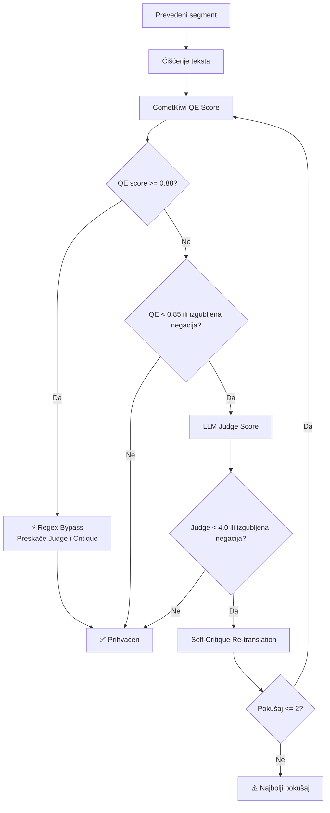

# Prevodilački Pipeline (Translation Pipeline)

Ovaj dokument opisuje celokupan **proces prevođenja** i lektorisanja unutar platforme **sinhronizuj.me**. Detaljno pokriva svaku komponentu, algoritam i odluku koja se donosi od trenutka kada sistem dobije originalne segmente na engleskom jeziku, do trenutka kada vrati finalne prevode na srpskom jeziku (ekavica, latinica).

## Povezane Beleške
*   [[00_MOC_Index]]
*   [[Funkcionalnosti_MOC]]
*   [[Audio_i_Video_Procesiranje]]
*   [[Sistem_Samounapredjenja]]

---

## 1. Pregled Arhitekture Prevođenja

Prevođenje se izvršava asinhrono unutar Celery radnika (zadatak `analyze_video_task` definisan u [tasks.py](file:///home/gruya/Projektri/sinhronizuj.me/backend/worker/tasks.py)) i koristi **Mistral-Small-3.2-24B-Instruct-2506** (8-bit kvantizovan preko bitsandbytes) model pokrenut na **Modal Serverless** GPU infrastrukturi (**A100-40GB GPU**).

Celokupan proces prevođenja i lekture spojen je u **jedinstveni prolaz (Single-Pass)** unutar modula [translate.py](file:///home/gruya/Projektri/sinhronizuj.me/backend/worker/translation/translate.py). Stari lektorski LLM radnik i fajl `lektor.py` su uklonjeni radi smanjenja troškova za ~50% i ubrzanja procesa za ~40%.

Proces se sastoji od:
*   **Jedinstveni LLM prolaz**: Generiše prevod svakog segmenta uz istovremenu lekturu, poštovanje glosara, RAG TM pretragu i TTS vremensku kompresiju integrisanu direktno u sistemski prompt.
*   **Deterministička post-obrada**: Nakon LLM prolaza, primenjuju se brza morfološka pravila iz modula [dialect.py](file:///home/gruya/Projektri/sinhronizuj.me/backend/worker/translation/dialect.py) (preko 100 regex zamena) i [transliter.py](file:///home/gruya/Projektri/sinhronizuj.me/backend/worker/translation/transliter.py) (preko 350 zamena dijalekata i ekavizacije).

---

## 2. Priprema i Optimizacija Segmenata

### 2.1. Segment Optimizer
Pre nego što segmenti uđu u modul za prevođenje, oni se procesiraju kroz [segment_optimizer.py](file:///home/gruya/Projektri/sinhronizuj.me/backend/worker/segment_optimizer.py) kako bi se rešili uobičajeni problemi sa STT transkriptom:
*   **Spajanje mikro-segmenata**: Segmenti kraći od `1.0s` se spajaju sa susednim segmentima.
*   **Semantičko spajanje**: Zavisni segmenti (rečenica prekinuta pauzom kraćom od `0.45s` i bez interpunkcije) se spajaju u logičku celinu.
*   **Delejnje predugih**: Segmenti duži od `6.0s` se dele na mestima interpunkcije ili na pola kako bi se olakšala sinteza zvuka.

### 2.2. Sentence-level Re-segmentation
Da bi se izbegao prelom rečenica koji je čest kod titlova, funkcija `group_segments_into_sentences()` privremeno grupiše segmente u celovite rečenice pre prevođenja:
```
Segment 1: "And this is"       (1.2s)
Segment 2: "exactly why"       (0.8s)
Segment 3: "we need to act."   (1.5s)
─────────────────────────────────────
→ Grupa:   "And this is exactly why we need to act."
```
*   **Pravila**: Grupa se prekida na završnoj interpunkciji (`.`, `!`, `?`, `...`) ili kada ukupno trajanje grupe pređe `12.0s`.
*   Nakon što se prevod završi, funkcija `split_translated_text()` proporcionalno raspoređuje prevedene reči nazad na originalne vremenske segmente na osnovu dužine originalnih karaktera.

### 2.3. Maskiranje Entiteta (`masking.py`)
Da bi se zaštitili delovi teksta koji se ne prevode, primenjuje se maskiranje pre slanja LLM-u:
*   **Tehničko-naučni entiteti**: `Wi-Fi` -> `[ENTITY_0]`
*   **Kod**: `print("hello")` -> `[CODE_0]`
*   **URL-ovi/Email**: `https://example.com` -> `[URL_0]`, `user@mail.com` -> `[EMAIL_0]`

---

## 3. Generisanje Konteksta i RAG Translation Memory

Pre slanja teksta na prevođenje, sistem u pozadini gradi bogat kontekst za LLM:

1.  **Video Summary (Sažetak)**: LLM na osnovu celog transkripta generiše sažetak videa (do 100 reči) koji pomaže modelu da razume temu i ton (npr. naučni video, tutorijal, intervju).
2.  **Dynamic Glossary (Dinamički glosar)**:
    *   Sistem detektuje temu i ključne stručne termine u videu (`detect_topic_and_terms`).
    *   Proverava da li termini postoje u statičkom glosaru ([glossaries.json](file:///home/gruya/Projektri/sinhronizuj.me/backend/worker/glossaries.json)) koji pokriva kategorije: *Zavarivanje/Zanati*, *Biologija/Priroda*, i *Tehnologija/IT*.
    *   Ako je termin nov, LLM ga prevodi na srpski pre samog prevođenja videa i dodaje u dinamički glosar.
3.  **RAG Translation Memory**:
    *   Preko modela `paraphrase-multilingual-MiniLM-L12-v2` generišu se vektorski embedding-zi (384 dimenzije).
    *   Za svaki segment, sistem pretražuje bazu potvrđenih prevoda korisnika (`translation_memory`) i pronalazi do 2 najsličnija primera (gde je kosinusna sličnost $\ge 0.80$). Ovi primeri se ubacuju u prompt kao one-shot primeri.
4.  **Wiki Pravila**:
    *   Učitavaju se korisnička i globalna pravila iz baze (`wiki_rules`) i ugrađuju se direktno u sistemski prompt (npr. "Brendove piši fonetski: YouTube -> Jutjub").

---

## 4. Kvalitativni Gating i Samokritika (Self-Critique Loop)

Nakon što se dobije inicijalni prevod za batch od 25 rečenica, svaki segment prolazi kroz trostepenu kontrolu kvaliteta (`qe.py`):



### 4.1. Uсловни Regex Bypass
Ukoliko segment u prvom prolazu ostvari izuzetno visok kvalitet (`qe_score >= 0.88`), sistem primenjuje **Regex Bypass** koji potpuno preskače LLM-as-a-Judge i Self-Critique korake. Ovo ubrzava prevođenje za oko **40%** bez narušavanja tačnosti.

### 4.2. CometKiwi QE Score i Kazneni Poeni
Kvalitet se procenjuje bez referentnog prevoda na osnovu kosinusne sličnosti semantičkih vektora, umanjene za kaznene poene:
*   **Izgubljena negacija**: $-0.20$ (detektuje se poređenjem 16 EN i SR šablona za negaciju).
*   **Ijekavizmi/Regionalizmi**: $-0.10$ po detektovanoj reči sa crne liste.
*   **Brojevi u ciframa**: $-0.08$ (pravilo je da svi brojevi budu ispisani rečima).
*   **Predugačak prevod**: $-0.05$ (ako je prevod preko 1.5 puta duži od originala).

### 4.3. LLM Judge i Self-Critique
Ako je `QE < 0.85`, poziva se Mistral-Small kao sudija koji ocenjuje prevod na skali od 1.0 do 5.0. U slučaju ocene `< 4.0`, pokreće se **Self-Critique** petlja (maksimalno 2 pokušaja) sa dinamičkim uputstvima za popravku (npr. "Skrati prevod na 45 karaktera" ili "Napiši brojeve rečima").

---

## 5. Integrisana Lektorska Revizija i Kompresija

Uklanjanjem odvojenog drugog prolaza, lektorska logika i optimizacije su integrisane direktno u modul [translate.py](file:///home/gruya/Projektri/sinhronizuj.me/backend/worker/translation/translate.py) kako bi se sve odradilo u okviru jednog radnog procesa:
1.  **Deduplikacija**: Izbegava se ponovno prevođenje identičnih tekstova. Segmente sa Jaccard sličnošću $\ge 0.85$ sistem prepoznaje kao duplikate i kopira rešenja (pomoćna funkcija `calculate_jaccard_similarity` je prebačena u `translate.py`).
2.  **TTS-Aware Compression (LLM Kompresija)**: Tokom samog prevođenja i evaluacije, meri se dužina teksta u odnosu na vremenski limit segmenta. Ako tekst prelazi limit za više od 15%, poziva se funkcija `compress_sentence_via_llm()` koja inteligentno skraćuje rečenicu zadržavajući smisao koristeći Mistral-Small model, kako govor u TTS fazi ne bi zvučao neprirodno brzo.
3.  **Leak Guard**: Brza provera i ispravka preostalih ijekavizama i nedoslednosti primenom determinističkih regex pravila odmah nakon LLM prolaza.

---

## 6. Determinističko Post-procesiranje

Nakon što tekst prođe kroz LLM faze, na njega se primenjuje brzi deterministički sloj:
1.  **Transliteracija (`to_latin`)**: Prebacuje tekst iz ćirilice u latinicu i zamenjuje specifične karaktere.
2.  **Ekavizacija (350+ pravila)**: Uklanja preostale ijekavizme i kroatizme (npr. *sustav* -> *sistem*, *tjedan* -> *nedelja*, *tisuća* -> *hiljada*, *siječanj* -> *januar*).
3.  **Čišćenje dijalekata (`clean_translation_text`)**: Primena preko 100 regex pravila u [dialect.py](file:///home/gruya/Projektri/sinhronizuj.me/backend/worker/translation/dialect.py) (npr. spajanje infinitiva sa "će" -> *radiće* na osnovu whitelist-a od 50+ glagolskih osnova).
4.  **Konverzija brojeva (`numbers_to_words.py`)**: Automatski prevodi brojeve i procente u ekavske reči (npr. *5%* -> *pet posto*, *2026.* -> *dve hiljade dvadeset šesti*).
