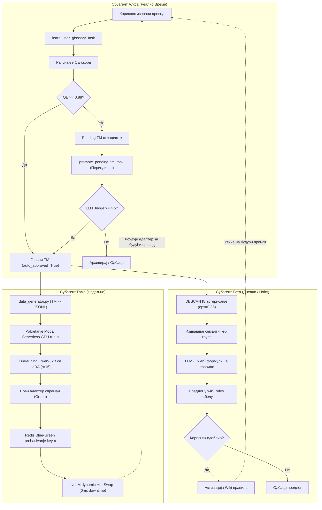

# Систем Самоунапређења (Perpetual Learning System) — Детаљна Документација

> Овај документ детаљно описује тростепени систем за аутоматско, непрекидно учење и самоунапређење превода на платформи sinhronizuj.me.
> Систем се састоји од три независна агента (Алфа, Бета и Гама) који заједно чине затворену петљу учења (Feedback Loop) из корисничких исправки.

---

## Садржај

1. [Преглед архитектуре самоунапређења](#1-преглед-архитектуре-самоунапређења)
2. [Субагент Алфа: Real-time "Тихи Консензус"](#2-субагент-алфа-real-time-тихи-консензус)
3. [Субагент Бета: Ноћни "Ловац на Обрасце"](#3-субагент-бета-ноћни-ловац-на-обрасце)
4. [Субагент Гама: Недељни LoRA Fine-Tuner](#4-субагент-гама-недељни-lora-fine-tuner)
5. [Редис Blue-Green Hot-Swap Механизам](#5-редис-blue-green-hot-swap-механизам)
6. [Дијаграм тока самоунапређења](#6-дијаграм-тока-самоунапређења)

---

## 1. Преглед архитектуре самоунапређења

Систем је дизајниран да реши највећи проблем традиционалних LLM преводилаца — статичност. Уместо да користимо фиксне промптове, наш систем анализира шта корисник ручно мења у финалном преводу и користи те податке за аутоматско прилагођавање будућих превода кроз три фазе времена реакције:

| Агент | Реакција | Технологија | Циљ |
|---|---|---|---|
| **Алфа (Alpha)** | **Реално време** | Celery + RAG (Vector TM) | Одмах побољшава наредне сегменте у истом пројекту |
| **Бета (Beta)** | **Дневно (Ноћу)** | DBSCAN + Qwen-32B | Открива општа стилска правила и предлаже их у Wiki правила |
| **Гама (Gamma)** | **Недељно** | Modal (Serverless Fine-tuning) | Трeнира нови LoRA адаптер за дубоко стилско прилагођавање |

---

## 2. Субагент Алфа: Real-time "Тихи Консензус"

Алфа агент је задужен за моментално учење. Када корисник у едитору изврши исправку већ преведеног сегмента и сачува промене, тригер се шаље кроз Celery задатак:

```
learn_user_glossary_task(segment_id, old_text, new_text)
```

### 2.1 Процес Евалуације и Упис у Меморију
1. **Анализа Квалитета:** Систем рачуна QE скор (`qe_score`) исправеног сегмента користећи `get_comet_kiwi_score()`.
2. **Тихи Консензус (Ауто-одобрење):**
   - Ако је `qe_score >= 0.88` (изузетан квалитет и сигурност), систем га аутоматски сматра исправним и уписује у главну табелу `translation_memory` са пољем `auto_approved=True`.
   - Генерише се семантички embedding за оригинални текст (384-димензионални вектор) који омогућава RAG-у да га пронађе у будућим преводима.
3. **Pending Складиште:**
   - Ако је `qe_score < 0.88`, пар се уписује у помоћну табелу `pending_translation_memory`. Овај превод се сматра "сумњивим" и не улази одмах у базу примера како не би загадио контекст.
4. **Промоција (Celery Beat):**
   - Периодични Celery Beat задатак `promote_pending_tm_task` прегледа `pending_translation_memory` табелу.
   - Користи строжији LLM Judge корак над овим сегментима. Уколико LLM Judge потврди квалитет скором `>= 4.5/5.0`, сегмент се промовише у главну `translation_memory` табелу.

---

## 3. Субагент Бета: Ноћни "Ловац на Обрасце"

Субагент Бета ради анализу на средњем нивоу кохерентности. Сваког дана у поноћ, Celery Beat покреће скрипту `backend/worker/translation/pattern_miner.py`.

### 3.1 Алгоритам Кластеровања (DBSCAN)
Анализа се врши над свим новим записима у `translation_memory` додатим у претходних 24 сата за одређеног корисника:

1. **Векторизација:** Учитавају се embedding-зи оригиналних реченица.
2. **Кластерисање:** Примењује се **DBSCAN** алгоритам (Density-Based Spatial Clustering of Applications with Noise) са параметрима:
   - `eps=0.35` (минимална семантичка удаљеност између тачака у кластеру)
   - `min_samples=3` (кластер се формира ако постоје најмање 3 сличне исправке)
3. **Изолација шума:** Сви изоловани случајеви који су специфични само за један сегмент се одбацују као шум, а задржавају се само систематске измене које корисник прави.

### 3.2 Формулисање Wiki Правила
За сваки пронађени семантички кластер (нпр. корисник је на 4 различита места исправио реч "framework" у "развојни оквир"):

1. Издвајају се оригиналне реченице и корисничке исправке из тог кластера.
2. Шаље се промпт Qwen-32B моделу да идентификује заједнички именитељ:
   - *„На основу ових примера исправки, формулиши једно прецизно лингвистичко правило за превођење на српски.”*
3. Модел генерише предлог правила у JSON формату:
   ```json
   {
     "title": "Превод термина Framework",
     "content": "Термин 'framework' у контексту програмирања увек преводити као 'развојни оквир', а не као 'оквир рада' или 'платформа'."
   }
   ```
4. Правило се аутоматски додаје у табелу `wiki_rules` са статусом предлога. Корисник у свом интерфејсу добија нотификацију и може да прихвати, измени или одбаци предложено правило. Одобрена правила одмах улазе у Фазу 0 превода.

---

## 4. Субагент Гама: Недељни LoRA Fine-Tuner

Најдубљи ниво самоунапређења обавља Гама агент који модификује саме тежине модела кроз Parameter-Efficient Fine-Tuning (PEFT).

### 4.1 Припрема Датасета (`data_generator.py`)
Сваке недеље, Celery задатак покреће `data_generator.py` који:
1. Прикупља све одобрене парове из `translation_memory` за корисника.
2. Филтрира парове са највишим скором квалитета (`qe_score >= 0.90`).
3. Форматира их у стандардни Qwen Chat шаблон (User: оригинални ЕН сегмент, Assistant: одобрени СР превод).
4. Записује податке у `dataset.jsonl` фајл на безбедно складиште.

### 4.2 Modal Serverless Тренинг (`train_lora.py`)
Тренинг се не покреће на локалном VPS-у јер захтева јаке GPU ресурсе. Систем покреће серверлесс функцију на **Modal** платформи:

1. **Динамички Спиновање:** Modal резервише **Nvidia A10G (24GB VRAM)** или јачи GPU.
2. **Преузимање Базе:** Преузима се припремљени `dataset.jsonl`.
3. **Подешавање Тренинга:**
   - Базни модел: `Qwen/Qwen2-32B-Instruct` (користи се AWQ/Marlin квантизација ради брзине и мањег отиска меморије).
   - LoRA параметри: `r=16`, `lora_alpha=32`, са циљањем пројекционих матрица (`q_proj`, `v_proj`, `k_proj`, `o_proj`).
   - Тренинг се покреће са малим бројем епоха (обично 3) како би се избегло преприлагођавање (overfitting) и сачувала општа способност превођења.
4. **Чување Адаптера:** Након успешног завршетка, генерисани LoRA адаптер се чува на Modal Volume / shared storage.

---

## 5. Редис Blue-Green Hot-Swap Механизам

Да би се избегао downtime приликом пребацивања на новoтренирани LoRA модел, имплементиран је Blue-Green систем преко Редис меморијског складишта.

### 5.1 Архитектура Пребацивања
vLLM сервер подржава динамичко учитавање LoRA адаптера у току рада (Hot-Swap). Систем одржава два логичка модела у Редису:
- `active_lora_version` -> Показује на тренутно активну верзију (нпр. `adapter_blue`).
- Нови адаптер се снима као алтернативна верзија (`adapter_green`).

```
[Korisnik šalje video na prevod]
           │
           ▼
┌───────────────────────────┐
│     Celery Translator     │
│  (Čita active_lora_key)   │
└──────────┬────────────────┘
           │
           ├──────────► [Redis: active_lora = "adapter_blue"]
           │            Позива vLLM са "adapter_blue"
           │
  (Nakon završetka)
  (Gamma agent postavlja novi adapter)
           │
           ├──────────► [Redis: active_lora = "adapter_green"]
           │
           ▼
[Sledeći API pozivi automatski rutiraju na "adapter_green"]
(Stari adapter "adapter_blue" se gasi u pozadini iz vLLM-a)
```

Овај приступ гарантује:
- **0ms downtime** током пребацивања модела.
- **Аутоматски Fallback:** Ако нови модел (Green) доживи пад или врати лош квалитет, Редис кључ се одмах враћа на претходно стабилно стање (Blue).

---

## 6. Дијаграм тока самоунапређења



---

> **Напомена**: Овај систем чини sinhronizuj.me јединственим јер сваки корисник временом добија високо персонализован модел који савршено разуме његов стил, терминологију и специфичности језика без икаквог ручног инжењеринга промптова.
